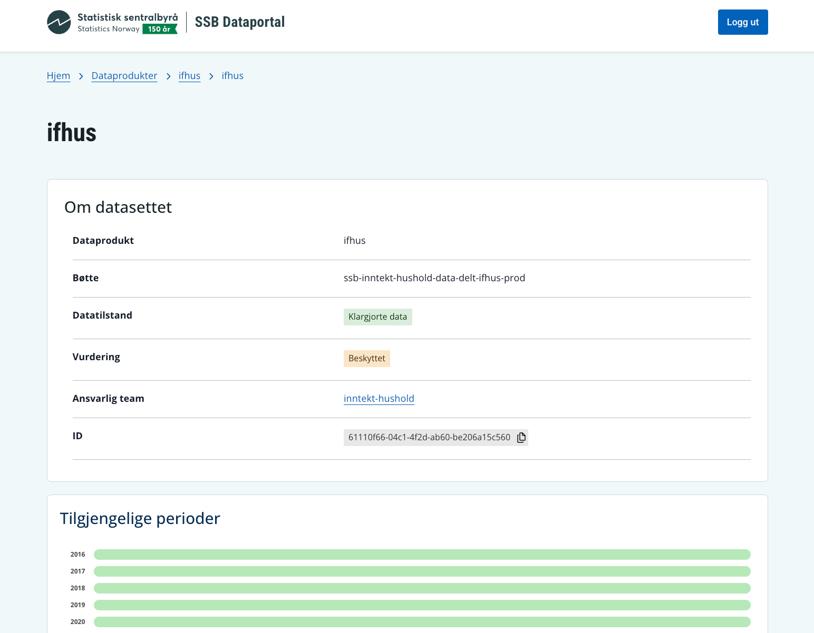

Team Metadata har lagt til visning av delte data i SSB Dataportal. Det betyr at alle interne og eksterne nå har tilgang til enkel metadata om hvert dataprodukt og datasett som deles på Dapla. 

## Hva er nytt?

SSB Dataportal støtter nå visning av enkel metadata om delte data på Dapla. Alle filer som følger SSBs navnestandard vil bli eksponert i SSB Dataportal. Informasjonen er i første omgang kun hentet fra filstiene og fra metadataene i bøtta, slik at alle kan se:

- kortnavnet til datasettet
- datatilstand
- verdivurdering
- filtype
- ansvarlig team
- periodisering
- hvilke perioder som er tilgjengelig
- hva slags dataprodukt

Senere vil dette bli beriket med mer detaljert informasjon. 

## Hvorfor har vi gjort disse endringene?

Metadata om stabile datatilstander har lenge vært planlagt formidlet gjennom vår datakatalog: **SSB Dataportal**. Etter at løsningen ble lansert med innhold fra Vardef, så har neste steg vært å formidle informasjon om våre dataprodukter. Senere vil også Klass også formidles gjennom dataportalen.    

## Hva betyr dette for deg?

Hvis du deler data gjennom delt-bøtter på Dapla, og følger [navnestandarden](../../../statistikkere/navnestandard.qmd) for lagring, så vil metadata om dataprodukt/datasett/datafiler vises i dataportalen.

{fig-alt="Alternativtekst" #fig-dataportal-ifhus}

