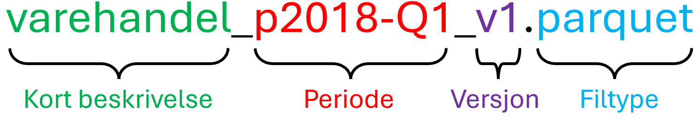
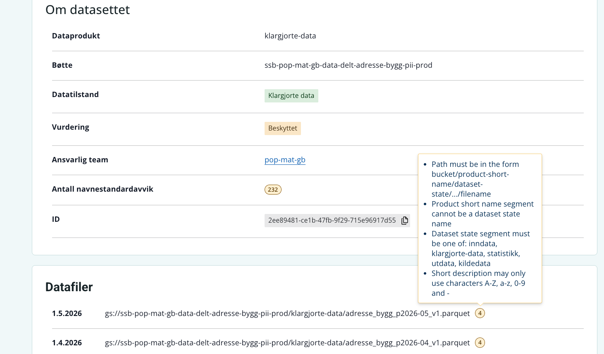

---
title: Presisering av navnestandard og kort beskrivelse i filnavn 
categories:
  - metadata
  - navnestandard
  - datadoc
  - ssb dataportal
author:
  - name: Øyvind Bruer-Skarsbø
    affiliation: 
      - name: Seksjon for dataplattform (724)
        email: obr@ssb.no
date: "06/10/2026"
date-modified: "06/10/2026"
image: ../../../images/filename-breakdown.png
draft: false
lightbox: true
--- 

I forbindelse med lanseringen av [Metadata om delte data i SSB Dataportal](../2026-06-09-updated-data-catalog/index.qmd) er det identifisert at flere team lagrer filer i delt-bøtter som ikke følger navnestandarden. 

## Hva er nytt?

Ingenting er nytt, men vi ønsker å presisere hvordan filnavn skal struktureres slik at de er tråd med [navnestandarden](../../../statistikkere/navnestandard.qmd). Avvik fra navnestandarden gjør at integrerte systemer som **Datadoc** og **SSB Dataportal** ikke får vist riktig informasjon om SSBs data. 

## Hva betyr dette for meg?

Flere team bruker understrek `_` istedenfor `-` i den *korte beskrivelsen* i filnavnet. @fig-navnestandard-breakdown viser hva som utgjør den korte beskrivelsen i et filnavn. Hvis den korte beskrivelsen inneholder to ord, f.eks. **varehandel-foreloepig** så skal det benyttes bindestrek iht navnestandarden. Hvis ditt team benytter understrek eller annet så ber vi dere endre dette i koden deres og på filene som allerede er skrevet.  

Dette gjelder bare for den korte beskrivelsen. Det skal være understrek før periode og versjon. 

 

{fig-alt="Alternativtekst" #fig-navnestandard-breakdown}

## Kan jeg få hjelp? 

For data i delt-bøtter kan man logge seg inn i [SSB Dataportal](https://dataportal.ssb.no/data-products) og sjekke om dine delte datasett følger navnestandarden. @fig-dataportal-validering viser datasett med 4 feil, inkludert en feil struktur på kort beskrivelse i filnavn.  

 

{fig-alt="Alternativtekst" #fig-dataportal-validering}
