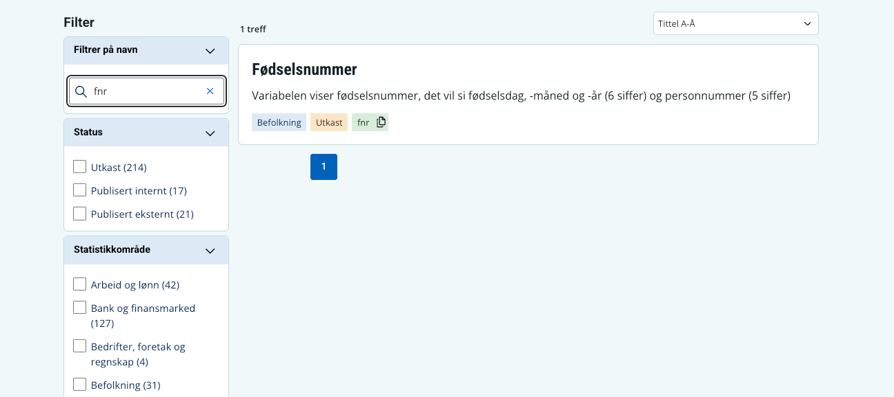

Fra og med 19. juni 2026 kan du også få treff på kortnavn i `Filtrer på navn` i SSB Dataportal.

Endringen er gjort basert på tilbakemeldinger fra brukere, der flere forventet at kortnavn skulle inngå i navnefilteret. Den gjør det også enklere for brukere å undersøke hvilke kortnavn som er reservert i Vardef. 

{fig-alt="Alternativtekst" #fig-dataportal-shortname-search}
