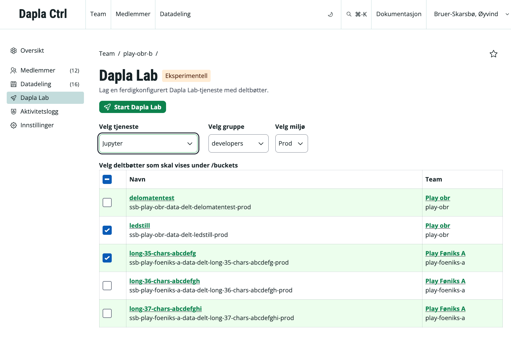

Som et sommereksperiment er det nå rullet ut en ny måte å starte Dapla Lab-tjenester på. I Dapla Ctrl har alle brukere fått en egen fane for **Dapla Lab** i venstremenyen til hvert team, hvor de kan sette opp en tjeneste før de sendes videre til Dapla Lab for videre konfigurering.

Endringen gjør det enklere å legge til delte bøtter allerede før tjenesten startes. Det betyr også at brukere blir mindre avhengige av tidligere lagrede tjenestekonfigurasjoner for å få satt opp miljøet de trenger.

Løsningen gjelder alle Dapla Lab-tjenester. Du velger først tjeneste, gruppe og miljø i Dapla Ctrl, og kan deretter fortsette med ytterligere valg i Dapla Lab.

Dette skal gi en enklere og mer forutsigbar vei fra oppsett til oppstart, spesielt når man trenger tilgang til delte bøtter fra start.

::: {.callout-caution}
## Eksperimentell funksjonalitet

Konfigurasjon av Dapla Lab fra Dapla Ctrl er eksperimentell funksjonalitet og det er ikke sikkert at den vil bestå over tid. Fremover vil vi vurdere mange tiltak for å gjøre det lettere for brukerne å starte tjenester med ønsket konfigurasjon.
:::

{fig-alt="Alternativtekst" #fig-dapla-ctrl-and-lab}
