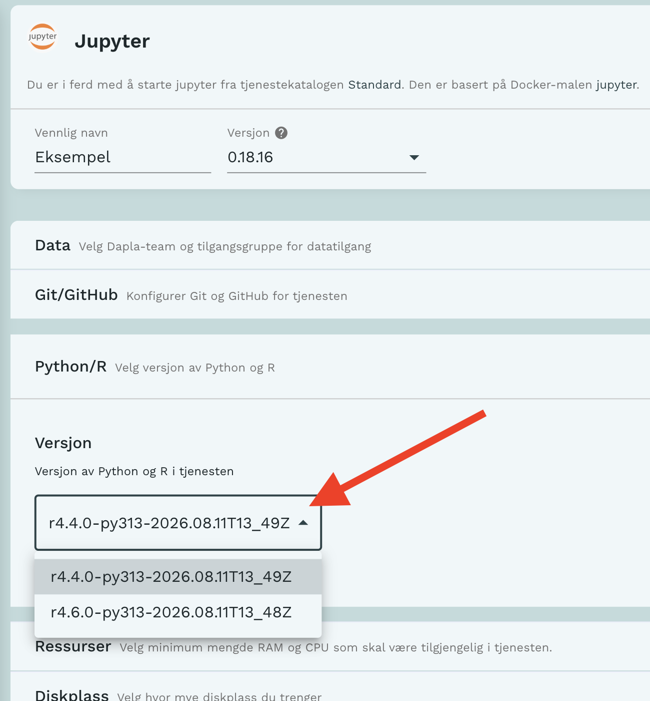

**R-versjon 4.6.0** er nå tilgjengelig i Dapla Lab.

R-versjon 4.4.0 er fortsatt tilgjengelig og de som bruker den kan fortsette som før.

## Hvordan starte tjenester med R 4.6.0

For å bruke R 4.6.0 i Dapla Lab må du gjøre endringer i tjenestekonfigurasjonen før oppstart.

Under "Python/R" vil det være mulig å endre versjon til R 4.6.0. Se figuren under.

{fig-alt="Alternativtekst" #fig-endre-r-versjon}
