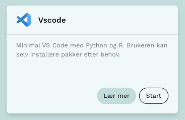

Vscode-python tjenesten har nå endret navn fra **Vscode-python** til **Vscode** for å reflektere at det ikke kun er python som er tilgjengelig i tjenesten.

{fig-alt="Alternativtekst" #fig-vscode-icon}

## Hva betyr endringen?

Endringen medfører at brukere som har lagrede tjenestekonfigurasjoner for vscode-python må nå gjennopprette dem. Den gamle vscode-python tjenesten eksisterer fortsatt slik at man likevel får startet lagrede tjenestekonfigurasjoner, men tjenesten vil ikke lenger bli oppdatert. Til gjengeld er det nå enkelt å lage nye tjenestekonfigurasjoner uten å fylle ut alle feltene manuelt via Dapla Ctrl. 

[Se her](../2026-07-02-dapla-lab-fra-dapla-ctrl/) for mer informasjon. 
