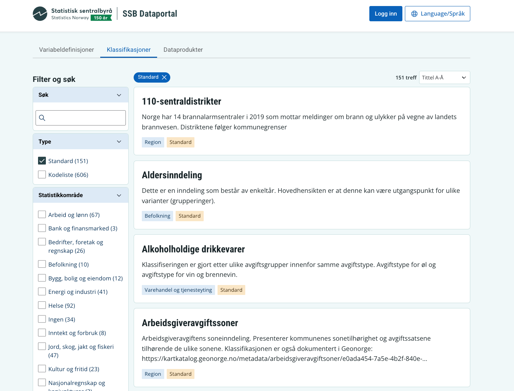

Klass-visningen på [ssb.no/klass](www.ssb.no/klass) skal flyttes over til [SSB Dataportal](https://dataportal.ssb.no/classifications), og vi trenger 4 personer til å brukerteste den nye løsningen i uke 36/37.

{fig-alt="Alternativtekst" #fig-vscode-icon}

## Hvem ser vi etter? 

- Du jobber i SSB og bruker en stor del av arbeidsdagen på statistikkproduksjon eller forskning.
- Ingen spesielle tekniske forkunnskaper kreves – det holder at du kjenner godt til statistikkproduksjon i det daglige.

Testingen består av vi stiller noen spørsmål og lar dere prøve ut nye Klass. Det tar ca. 30-60 min, litt avhengig av hvor mye dere har på hjertet. Dette hjelper oss å være sikre på at Klass fungerer som tenkt før det åpnes for et eksternt publikum på https://dataportal.ssb.no/classifications.

**Interessert?** Legg igjen en [kommentar i denne tråden på Viva Engage](https://engage.cloud.microsoft/main/org/ssb.no/threads/eyJfdHlwZSI6IlRocmVhZCIsImlkIjoiMzk5NTc0NzMwMTM5MjM4NCJ9?trk_copy_link=V2) dersom du har lyst til å bidra!
