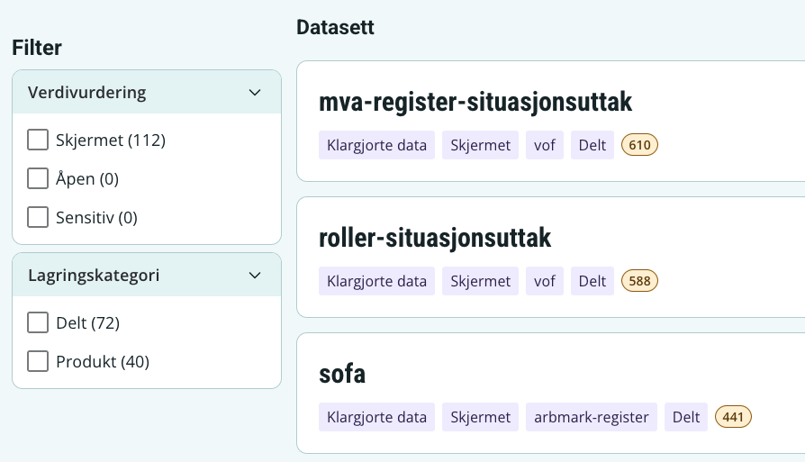
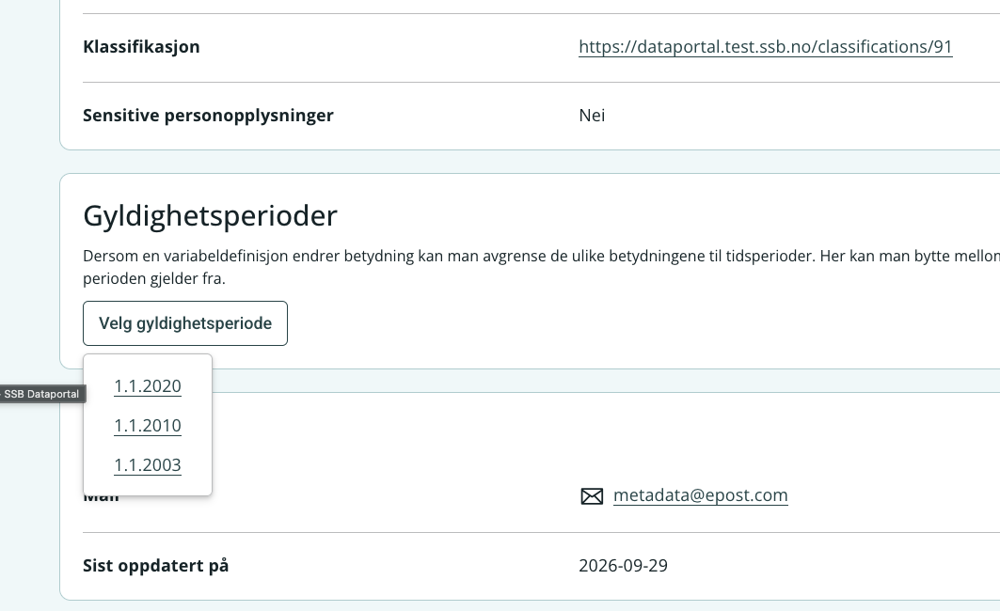
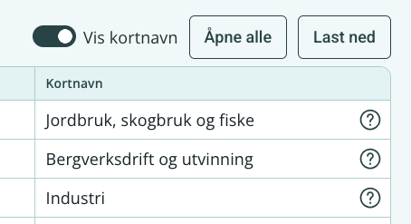
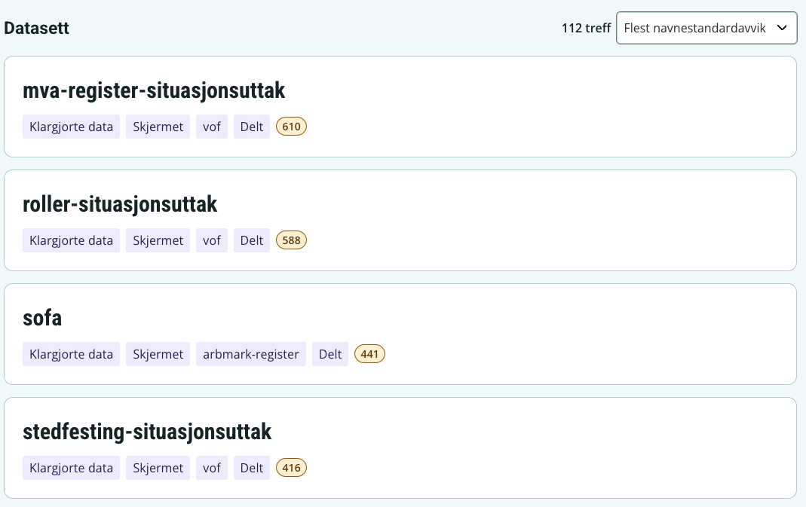
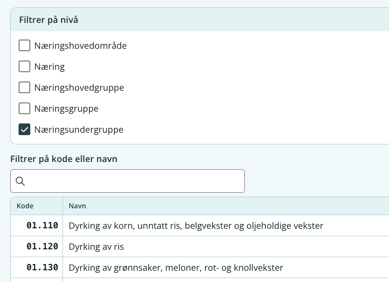
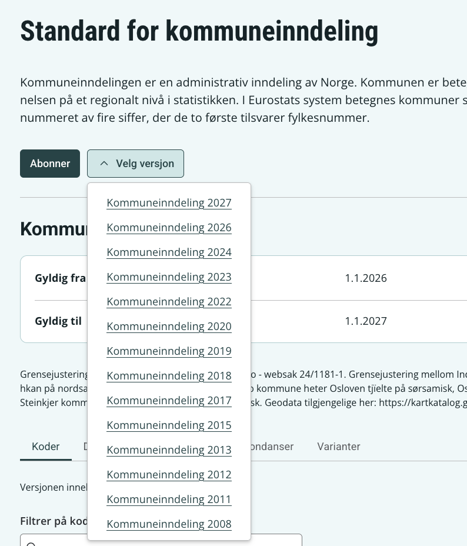

Team Metadata har jobbet i det siste med å fikse småfeil, implementere brukerønsker og gjøre Dataportalen enda finere å bruke. Det er noen ting som dere sikkert har merket og noen ting som er mindre synlige.

## Generellt

- Vi har tatt i bruk SSBs nye designsystem og visuell profil, samt fjernet landingssiden til fordel å komme fortere frem til klassifikasjoner.

## Klassifikasjoner

- Basert på tilbakemeldinger fra brukere er det nå mulig å velge nivåer når man ser på eller laster ned koder fra en klassifikasjon.
- Det er mulig å se kortnavn på koder dersom de er tilgjengelige.
- Lange koder er nå vist i sin helhet, ikke kuttet av. 
- Det er nå fikset slik at man kan se fremtidige varianter også.
- Søketreff på deler av sammensatte ord f.eks "kommune" får bedre treff på f.eks "kommuneinndeling".
- Basert på tilbakemeldinger fra brukere er det nå mulig å søke på klassifikasjoner etter ID f.eks "131" kommer frem til kommuneinndeling.
- Versjonsvelgeren for en klassifikasjon bruker nå en mer oversiktlig nedtrekk-løsning. 

## Variabeldefinisjoner

- Dersom en variabeldefinisjon har flere gyldighetsperioder er det nå mulig å vise og dele en lenke til en av de spesifikt.

## Dataprodukter

- Det er nå mulig å sortere datasett etter antall navnestandardavvik for å kunne lettere prioritere arbeid med å rette opp i disse.
- Det er nå mulig å filtrere datasett etter om de ligger i en produkt eller delt bøtte

{group="my-gallery"}

{group="my-gallery"}

{group="my-gallery"}

{group="my-gallery"}

{group="my-gallery"}

{group="my-gallery"}