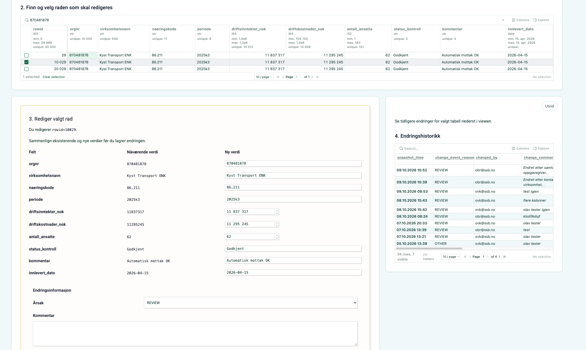

[Tirsdag 6. oktober lanserte vi Parquedit](../2026-10-06-parquedit-lansering/index.qmd), en lagringsløsning for manuell editering i SSB. Nå lanserer vi [Parqueditor](../../../statistikkere/parqueditor.qmd) - et grafisk grensesnitt for å manuelt editere Parquedit-tabeller. Parqueditor er en tjeneste på Dapla Lab som kan benyttes av alle Dapla-team som jobber med Parquedit-tabeller. Under er en kort video som viser funksjonaliteten:

{fig-alt="Alternativtekst" #fig-parquedit-demo}

## Hva er nytt? 

Team i SSB som gjør manuell editering har nå en et enkelt grafisk grensesnitt for gjøre endringer i Parquedit-tabeller. 

## Planer fremover

Appen som vises i videoen over er kun et enkelt eksempel på hvordan Parqueditor kan benyttes. Om kort tid vil brukere kunne peke på sitt egne [Marimo](../../../statistikkere/marimo.qmd)-applikasjoner og starte den i Parqueditor.  

