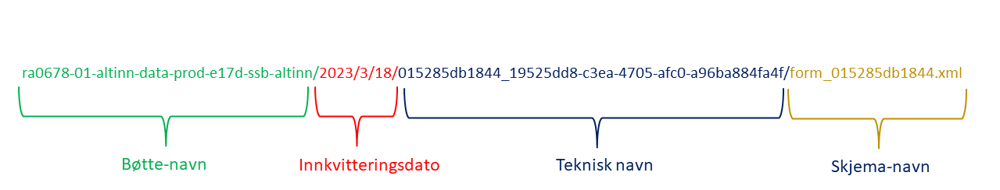
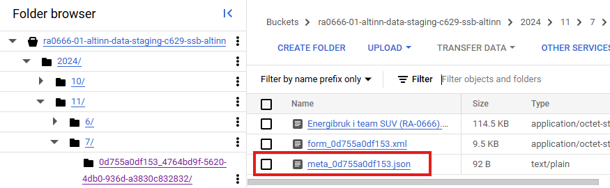
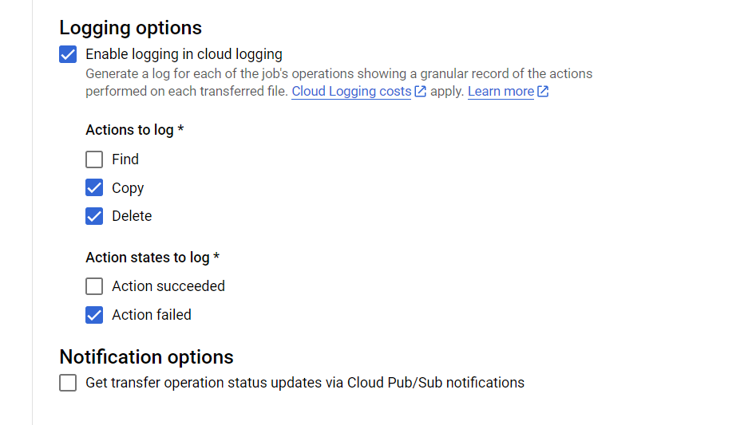

{style="max-width: 50%; float: right;" fig-alt="Dapla logo"}

Frem mot sommeren 2026 skal alle skjema-undersøkelser i SSB som gjennomføres på **Altinn 2** flyttes over til [Altinn 3](https://docs.altinn.studio/nb/community/about/). Skjemaer som flyttes til Altinn 3 vil motta sine data på **Dapla**, og ikke på *bakken* som tidligere. Datafangsten håndteres av [Team SU-V](https://statistics-norway.atlassian.net/wiki/spaces/CUL/pages/2805530625/Teamsider), mens statistikkseksjonene henter sine data fra Team SU-V sitt lagringsområde på Dapla. I dette kapitlet beskriver vi nærmere hvordan statistikkseksjonene kan jobbe med Altinn3-data på Dapla. Kort oppsummert består det av disse stegene:

1. Statistikkprodusenten avtaler overføring av skjema fra **Altinn 2** til **Altinn 3** med planleggere på **S821**, som koordinerer denne jobben. 
2. Når statistikkprodusentene får beskjed om at Altinn3-skjemaet skal sendes ut til oppgavegiverne, så må de opprette et [Dapla-team](./opprette-dapla-team.html).
3. Når Dapla-teamet er opprettet, og første skjema er sendt inn, se ber de om at Team SU-V gir tilgang til teamets *Transfer Service* instans. Søknad om tilgang gjøres gjennom Kundeservice og [selvbetjeningsportalen](https://ssb.pureservice.com/). For å søke om tilgang velger du **Meld sak til Spørreundersøkelser virksomhet (SU-V)**. Her vil du finne et eget skjema som du fyller ut for å søke om tilgang. Merk at det må gis separate tilganger for data i test- og produksjonsmiljø. 
4. Statistikkprodusenten setter opp en automatisk overføring av skjemadata med [Transfer Service](./transfer-service.html), fra Team SU-V sitt lagringsområde over til Dapla-teamet sin kildebøtte.
5.  Statistikkprodusentene kan begynne å jobbe med dataene i Dapla. Blant annet tilbyr Dapla en **automatiseringstjeneste** som man kan bruke for å prosessere dataene fra kildedata til inndata^[En typisk prosessering som de fleste vil ønske å gjøre er å konvertere fra xml-formatet det kom på, og over til parquet-formatet.].

I resten av kapitlet gis en oversikt over hvordan statistikkteam kan jobbe med data fra Altinn 3. 


## Ansvarsfordeling

Team SU-V har ansvaret for datafangst fra Altinn3 til SSB. Deretter tilgjengeliggjør de dette for statistikkteamet som skal jobbe videre med dataene for å produsere statistikk. 

Det er statistikteamet som lagrer dataene som sin kildedata som er ansvarlig for dataene og at disse håndteres på riktig måte. Av den grunn er det statistikteamet som setter opp jobben for å synkronisere data fra bøtta til Team SU-V til sin kildebøtte, slik at de kan organisere dataene som de ønsker. I tillegg vil backup av data bli håndtert i kildebøtta til statistikkteamet.

## Tilgangsstyring

Skjemaer fra Altinn 3 hentes inn til SSB av team SU-V og lagres i delt-bøtter som SU-V administrerer. SU-V kan deretter gi tilgang til statistikkteam slik at de hente data fra bøttene og lagre det i sine kildebøtter. Siden tilgangsstyring mellom **prod**- og **test**-miljøet fungerer ulikt så forklarer vi hver av de under.

### Prod

Tilgang til bøtter med skjemadata i prod-miljøet gis kun til [Transfer Service](./transfer-service.qmd) for kildeprosjektet til statistikkteamet, og aldri direkte til brukere. Dvs. at team SU-V gir tilgang til Transfer Service til statistikkteamet, og deretter kan statistikkteamet sette opp en automatisk jobb med Transfer Service som synkroniserer data fra SU-V sin delt-bøtte og over til statistikkteamets kildebøtte.

Siden tilgangsstyringen til data i prod er ganske restriktiv, så anbefaler vi at statistikere gjør seg kjent med sine skjemadata i test-miljøet (se under) før de starter arbeidet i prod. 

### Test

Tilgang til bøtter med skjemadata i test-miljøet er mindre restriktive enn for prod-miljøet, siden disse dataene er fiktive. Derfor anbefales det at statistikere først jobber i test-miljøet når de skal gjøre seg kjent med dataene fra Altinn 3. I test-miljøet kan både brukere og Transfer Service få tilgang til SU-V sine delt-data. 

## Data

Dataene som hentes inn av Team SU-V lagres som **xml**-filer i en bøtte. Statistikkteamet som skal hente inn dataene synkroniseres deretter dataene til sin delt-bøtte med [Transfer Service](./transfer-service.qmd). Det finnes både data og metadata om hvert skjema som sendes inn og under forklares innholdet i hver av de. 

### Skjemadata

Hvert skjema som leveres inn av en oppgavegiver blir lagret som en separat xml-fil med et unikt filnavn^[Teknisk sett er hele filstien det samme som et filnavn i en bøtte. Men det omtales heretter som *filnavn* og *filsti* for å kunne skille mellom hele stien, og det som tradisjonelt er oppfattet som filnavn.]. Under ser du et eksempel på hvordan et skjema kan se ut.

::: {.callout-caution collapse="true"}
## Eksempel på xml-fil

```xml
<?xml version="1.0" ?>
<melding xmlns:xsi="http://www.w3.org/2001/XMLSchema-instance" xmlns:xsd="http://www.w3.org/2001/XMLSchema" dataFormatProvider="SERES" dataFormatId="7079" dataFormatVersion="47315">
  <InternInfo>
    <raNummer>RA-XXXX</raNummer>
    <skjemaVersjon>1.0</skjemaVersjon>
    <undersoekelsesNr>XXXXX</undersoekelsesNr>
    <visOppgaveByrde>0</visOppgaveByrde>
    <visBrukeropplevelse>0</visBrukeropplevelse>
    <delregNr>2XXXXX</delregNr>
    <periodeFritekst>3. kvartal 2022</periodeFritekst>
    <periodeFomDato>2022-07-01</periodeFomDato>
    <periodeTomDato>2022-09-30</periodeTomDato>
    <periodeType>KVRT</periodeType>
    <periodeNummer>3</periodeNummer>
    <periodeAAr>2022</periodeAAr>
    <periodeDato> </periodeDato>
    <enhetsIdent>XXXXXX</enhetsIdent>
    <enhetsType>BEDR</enhetsType>
    <enhetsOrgNr>XXXXXXXXX</enhetsOrgNr>
    <enhetsNavn>STATISTISK SENTRALBYRÅ </enhetsNavn>
    <enhetsGateadresse>Akersveien 26</enhetsGateadresse>
    <enhetsPostnr>0177</enhetsPostnr>
    <enhetsPoststed>OSLO</enhetsPoststed>
    <enhetsAvdeling>AVD XXXX</enhetsAvdeling>
    <reporteeOrgNr>XXXXXXXXX</reporteeOrgNr>
  </InternInfo>
  <Kontakt>
    <kontaktPersonNavn>OLA NORDMANN</kontaktPersonNavn>
    <kontaktPersonEpost>ola@tull.no</kontaktPersonEpost>
    <kontaktPersonTelefon> </kontaktPersonTelefon>
    <kontaktInfoBekreftet>1</kontaktInfoBekreftet>
    <kontaktInfoKommentar>Dette er en et eksempel for Dapla-manualen</kontaktInfoKommentar>
  </Kontakt>
  <Skjemadata>
    <ledigeStillinger>75</ledigeStillinger>
    <datoPrefill> </datoPrefill>
  </Skjemadata>
</melding>
```	
:::


Filstien til filene i team SUV-V sine delt-bøtter følger en streng navnestandard. @fig-altinn-path viser et eksempel på hvordan filstien til et fiktivt skjema kan se ut i bøtta til team SU-V. Filstien har egenskapen at den er globalt unik og inneholder informasjon om tidspunktet skjemaet ble innkvittert i SSB sine systemer.  

{fig-alt="Bilde av en typisk filsti som forklarer hva de ulike komponentene av stien betyr" #fig-altinn-path} 

Skjemanavnet du ser i @fig-altinn-path er unike. Dvs. at hvis en oppgavegiver sender inn flere skjemaer på samme dag, så er fortsatt skjemanavnet unikt. Det er viktig å være klar over når man bruker [automatiseringstjenesten for kildedata](./kildomaten.html) senere. Siden tjenesten trigges per fil, og man er avhengig av unike navn for å ikke skrive over filer, så er det nyttig å vite at man kan videreføre skjemanavnet i overgangen fra kildedata til inndata. 


### Metadata
For hver ny innsending fra Altinn3 i test- og prod-miljøet, så tilrettelegger team SU-V en json-fil med metadata om innsedningen. Filen inneholder foreløpig to variabler:

- **Referansenummeret** som oppgavegiver får ved innsending.
- **Tidspunkt** for når skjema er levert i Altinn3.

Brukerbehovet er i hovedsak dublettkontroll og svartjeneste. For dette trenger man et eksakt tidspunkt for når skjema faktisk ble sendt inn (trykket på knappen i Altinn). Merk at tidspunkt i fila er UTC.

Filen ligger i bøttene sammen med xml/pdf (og eventuelle vedlegg). Team T-Rex vil se videre på å integrere dette inn i sin Python-pakke.

```json
{
    "altinnReferanse": "f23415ca6b2f", 
    "altinnTidspunktLevert": "2024-04-29T07:16:10.5080448Z"
}
```

{fig-alt="Illustrasjon som viser innsending med metadata fra Altinn." #fig-altinn-jobbe-med-altinn3-innsending-meta}

## Synkronisering av data

Når et statistikkteam har fått beskjed av team SU-V at data er tilgjengelig deres delt-bøtte og at statistikkteamets Transfer Service har fått tilgang, så kan man sette opp synkronisering av data fra team SU-V til statistikkteamets kildebøtte. 

Når man synkroniserer data fra team SU-V til egen kildebøtte er det anbefalt å gjøre følgende:

**Lag en mappe per skjema**  
Før man setter opp synkroniseringen bør man opprette en mappe per datakilde som teamet har. Dette inkluderer både Altinn-kilder og andre kilder. Hvis teamet har flere skjemaer fra Altinn så kan man f.eks. bruke skjemanummer som øverste mappenivå i kildebøtta, og synkronisere hvert skjema til sin egen undermappe.

::: {.callout-caution collapse="true"}
## Eksempel på mappestruktur

```{.bash}
ssb-dapla-felles-data-kilde-prod
├── altinn
│   ├── ra0678
│   └── ra0778
└── andrekilder

```
:::


**Behold mappestrukturen til team SU-V**  
Når vi bruker Transfer Service til å synkronisere innholdet i Team SU-V sitt lagringsområde til Dapla-teamet sin kildebøtte, så er det anbefalt å fortsette å bruke mappe-strukturen som Team SU-V har for å sikre at ingen filer blir overskrevet på grunn av at de har identiske navn. 

::: {.callout-caution collapse="true"}
## Eksempel på mappestruktur for ra0678

```{.bash}
ssb-dapla-felles-data-kilde-prod
├── altinn
│   ├── ra0678
│   │   └── 2026
│   │       └── 3
│   │           └── 28
│   │               └── b66abe1880cc_a35bceb7-950d-4e9b-a4a0-caea736ab270
│   │                   └── form_b66abe1880cc.xml
│   └── ra0778
└── andrekilder
```
:::

### Transfer Service

Når vi skal overføre filer fra Team SU-V sin bøtte til vår kildebøtte, så kan vi gjøre det manuelt fra Jupyter som forklart her.. Men det er en bedre løsning å bruke en tjeneste som gjør dette for deg. [Transfer Service](./transfer-service.html) er en tjeneste som kan brukes til å synkronisere innholdet mellom bøtter på Dapla, samt mellom bakke og sky. Når du skal ta i bruk tjenesten for å overføre data mellom en bøtte fra Team SU-V sitt prosjekt **suv-altinn-data-p**, til en kildedata-bøtte i Dapla-teamet ditt, så gjør du følgende: 

1. Følg denne beskrivelsen hvordan man [setter opp overføringsjobber](./transfer-service.html#overføring-av-data).
2. Etter at du har trykket på `Create Transfer Job` velger du **Google Cloud Storage** på begge alternativene under **Get Started**. Deretter går du videre ved å klikke på **Next Step**.
3. Under **Choose a source** så skal du velge hvor du skal kopiere data fra. Trykk på **Browse**. I vinduet som dukker opp trykker du på 🔻-ikonet ved siden av **Project ID**. I søkevinduet som dukker opp søker du opp **suv-altinn-data-p** og trykker på navnet. Da får du listet opp alle bøttene i suv-altinn-data-p prosjektet. Til slutt trykker du på bøtta som Team SU-V har opprettet for undersøkelsen^[Bøttenavnet starter alltid med RA-nummeret til undersøkelsen.] og klikker **Select** til nederst på siden. Trykk deretter **Next step** for å gå videre. 
4. Under **Choose a destination** så skal du velge hvor du skal kopiere data til. Dette steget er ganske likt som forrige, men du skal nå velge ditt eget projekt og kildebøtta der. Trykk på **Browse**. I vinduet som dukker opp trykker du på 🔻-ikonet ved siden av **Project ID**. I søkevinduet som dukker opp søker du opp **\<ditt teamnavn\>-kilde-\<miljø\>** og trykker på navnet. Da får du listet opp alle bøttene i ditt team sitt prosjekt. Velg kildebøtta som har navnet **ssb-\<teamnavn\>-kilde-<miljø\>**. Hvis du ønsker å kopiere data til en undermappe i bøtta, så trykker du på <span style="color:red;">**>**</span>-ikonet ved bøttenavnet og velger ønsket undermappe^[Alternativt oppretter du en mappe direkte vinduet ved å trykke på mappe-ikonet med en **+**-tegn i seg.]. Til slutt trykker du på **Select** til nederst på siden. Trykk deretter **Next step** for å gå videre.
5. Under **Choose how and when to run job** velger du **Run with custom frequency** og **Starting now** i **Batch**-modus. Hvis du ønsker å overføre så ofte som mulig, så velger du **Custom frequency** og **Repeat every 1 Hours**. Til slutt trykker du **Next Step** nederst på siden.
6. Under **Choose Settings** så legger du til en kort beskrivelse av jobben du har opprettet. Under de andre valgene kan du gjøre følgende: 
    - Under **Advanced transfer Options** trenger du ikke gjøre noen endringer. 
    - Under **When to overwrite** kan du velge **If different**.
    - Under **When to delete** kan du velge **Never**.
    - Under **Manifest** trenger du ikke huke av. 
    - Under **Logging options** velger du samme som vist i @fig-ts-log.

{fig-alt="Bilde av en typisk filsti som forklarer hva de ulike komponentene av stien betyr" #fig-ts-log}

Til slutt trykker du **Create** for å aktivere tjenesten. Den vil da sjekke Team SU-V sin bøtte hver time og kopiere over alle filer som ikke allerede eksisterer statistikkteamets kildebøtte. 

## Kildomaten
Når du har satt opp Transfer Service til å kopiere over filer fra Team SU-V sin bøtte til statistikkteamets kildebøtte, så vil det potensielt komme inn nye skjemaer hver time. Siden ingen på statistikkteamet har tilgang til kildebøtta som standard^[Kun data-admins i teamet kan aktivere tilgang ved behov], så er neste steg å prosessere dataene med [Kildomaten](./kildomaten.qmd) og lagre dataene i produktbøtta hvot alle i teamet har tilgang. 

[Les mer om hvordan du kan bruker tjenesten her.](./kildomaten.html)

## Altinn3 til ISEE

Enkelte Dapla-team må flytte sine skjemaer over til Altinn 3, men ønsker å bruke ISEE videre i produksjonsprosessen. Det er fullt mulig og [dokumentert her](https://statistics-norway.atlassian.net/wiki/spaces/altinnpython/overview#Python-pakken-ssb-altinn-python-for-utflating-av-XML-filer).

Det er også utviklet en [Altinn3-pakke](https://statisticsnorway.github.io/ssb-altinn-python/) i Python som flater ut XML-filer fra Altinn 3 og lager en csv-fil som er på ISEE-format av innholdet. *ssb-altinn-python* er tilgjengelig i Kildomaten, og kan benyttes for å automatisk flate ut Altinn3-skjema mellom kilde- og produktbøtte.

Det er også [skrevet et blogginnlegg](../blog/posts/2025-04-07-altinn3-til-isee/index.qmd) som beskriver i mer detaljer hvordan man inkludere Altinn 3, Dapla og ISEE i et produksjonsløp. 

## Ende-til-ende-testing i Altinn
Det ble satt sammen en tverrfaglig arbeidsgruppe for å se på muligheten for å samle dokumentasjon knyttet til testing av skjematjenester i Altinn. Mandatet for gruppen har vært å få oversikt over prosessen [«Ende-til-ende-test»](https://statistics-norway.atlassian.net/wiki/spaces/A3/pages/4901634050/Ende-til-ende-testing+i+Altinn). Dokumentere og vise til relevant tilgjengelig informasjon.

## Videodokumentasjon
Det er utarbeidet [videodokumentasjon](https://statistics-norway.atlassian.net/wiki/spaces/CUL/pages/5319622698/Videodokumentasjon) som gir en innføring i SU-V sine tjenester på Dapla. Dokumentasjonen viser både bruk gjennom et grafisk brukergrensesnitt (A3Admin) og gjennom Python-pakken (dapla-suv-tools).