Dapla Ctrl^[Navnet Dapla Ctrl er valgt for å kommunisere at målsetning med appen er å administrere Dapla-team.] er tjeneste for tilgangsstyring på Dapla. Formålet med appen er at det skal være lett å få oversikt og administrere tilganger knyttet til [Dapla-team](./hva-er-dapla-team.html).

## Innlogging

Alle som jobber i SSB kan logge seg inn på <https://dapla-ctrl.intern.ssb.no/> for å bruke tjenesten.

## Funksjonalitet

Alle SSB-ansatte som logger seg inn i Dapla Ctrl får tilgang til å se informasjon om Dapla-team og tilganger. I tillegg kan de som har rollen **teamansvarlig** (ansvarlig seksjonsleder for teamet) legge til, fjerne og endre medlemmer i teamet de har denne rollen. Teamansvarlig har og tilgang til å opprette nye team og delegere rettigheten for tilgangsstyring.

### Teamoversikt

 

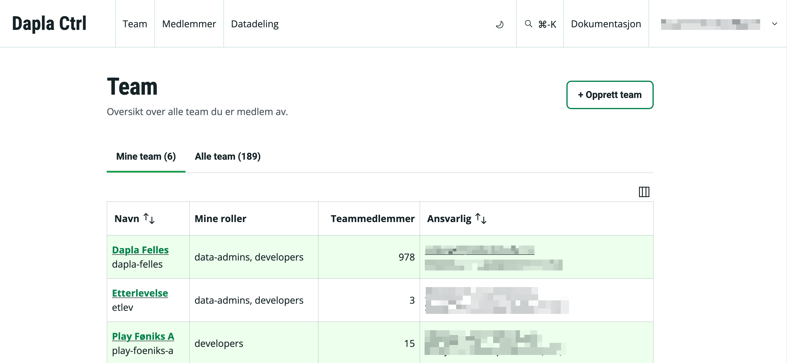{fig-alt="A drawing of an elephant." #fig-dapla-ctrl-teamoversikt}

@fig-dapla-ctrl-teamoversikt viser landingssiden/forsiden som først møter den som logger seg inn i Dapla Ctrl. den. Her får den som er innlogget oversikt over hvilke Dapla-team man er medlem av, og følgende informasjon om teamene:

- Visningsnavn for teamet
- Teknisk teamnavn
- Dine roller i teamene
- Antall teammedlemmer
- Teamansvarlig

Man kan også bytte fane fra **Mine team** til **Alle team** for å se følgende informasjon om alle team som finnes på Dapla:

- Visningsnavn for teamet
- Teknisk teamnavn
- Autonomitetsnivå
- Antall teammedlemmer
- Teamansvarlig 

### Teamdetaljer

 

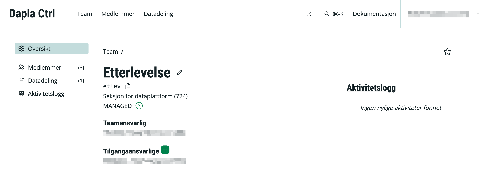{fig-alt="A drawing of an elephant." #fig-dapla-ctrl-teamvisning}

Fra [Teamoversikten](./dapla-ctrl.html#teamoversikt) kan man trykke seg inn på et spesifikt team og få en oversikt slik som vist i @fig-dapla-ctrl-teamvisning. 

På toppen av siden får man se følgende informasjon:

- teamets visningsnavn
- teamets tekniske kortnavn
- ansvarlig seksjon
- teamets autonomitetsnivå
- teamansvarlig
- tilgangsansvarlig

Videre er det er en venstremeny for å se hvem er **Teammedlemmer**, under **Datadeling** kan man se hvilke data teamet deler eller konsumerer fra andre team, og en *Aktivitetslogg* som viser endringer som er gjort i teamet. 

#### Medlemmer

Under fanen for **Medlemmer** ser man følgende informasjon om alle medlemmene av teamet:

- navn på medlem
- e-postadresse
- hvilken seksjon de jobber på
- hvilken tilgangsgruppe de tilhører i teamet

#### Datadeling

Under fanen **Datadeling** får man en oversikt over hvilke data som deles mellom teamet deler andre team. Fanen **Deler** viser hvilke deltbøtter teamet deler med andre team, mens fanen **Konsumerer** viser hvilke deltbøtter fra andre team som teamet har tilgang til. 

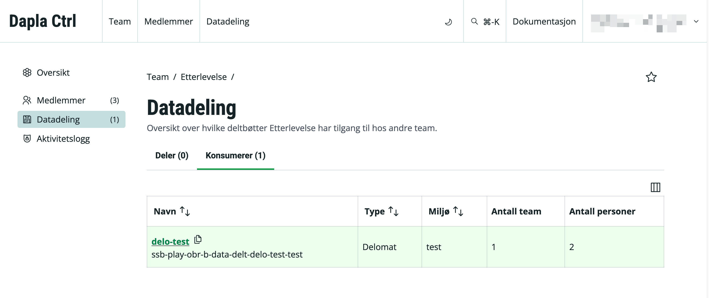{fig-alt="A drawing of an elephant." #fig-dapla-ctrl-delte-data}

@fig-dapla-ctrl-delte-data viser hvilken informasjon man får over teamets delte data. Følgende informasjon vises:

- kortnavnet på bøttene
- tekniske navnet til bøttene
- type delt-bøtte
- hvilket miljø bøtta ligger i
- hvor mange team som har tilgang
- hvor mange personer som har tilgang^[**Antall personer** som har tilgang til en delt-bøtte viser hvor mange personer det er som har tilgang fra de teamene som har tilgang. Som regel vil det være slik at kun noen tilgangsgrupper i et team får tilgang til andre sine delte data, og ikke hele teamet.]

#### Aktivitetslogg

Viser alle endringer som har blitt gjort i teamet.

### Medlemmer

 

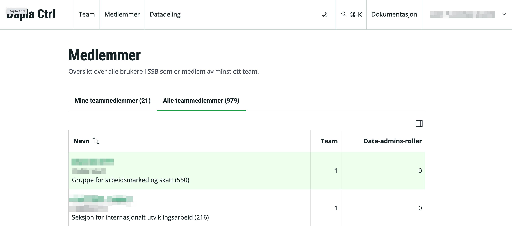{fig-alt="A drawing of an elephant." #fig-dapla-ctrl-all-members}

Øverst på siden kan man velge **Medlemmer** og få oversikt over alle SSB-brukere som er medlem av minst ett Dapla-team. Den viser også hvor antall team de er medlem av og hvor mange team de er **data-admins** i.

#### Medlemsdetaljer

 

{fig-alt="A drawing of an elephant." #fig-dapla-ctrl-medlemsdetaljer}

@fig-dapla-ctrl-medlemsdetaljer viser hva man ser når går inn på en enkeltbruker, enten via [Teamoversikten](./dapla-ctrl.html#teamoversikten) eller [Teammedlemmer](./dapla-ctrl.html#teammedlemmer). Øverst på siden står navnet til personen, e-postadressen deres, stillingstittel og hvilken seksjon de jobber på. Undersidene Medlemskap og Datatilgang gir oversikt over henholdsvis hvilke team personen er medlem av og hvilke delte data de har tilgang til.

### Datadeling

 

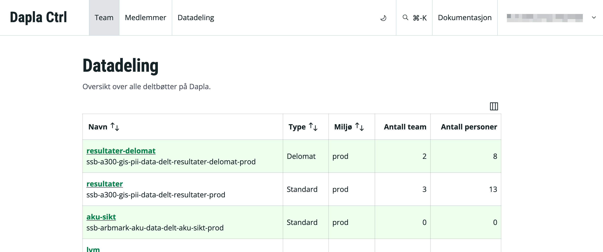{fig-alt="A drawing of an elephant." #fig-dapla-ctrl-datadeling-all}

Øverst på siden kan man velge **Datadeling** og få oversikt over alle delt-bøtter på Dapla. Trykker man seg på en enkeltbøtte så får man opp 

### Opprette team

:::: {.columns}

::: {.column width="70%"}

Det er kun **seksjonsledere** i SSB som kan opprette et Dapla-team. Hvis en seksjonsleder logger seg inn i Dapla Ctrl så vil knappen i @fig-dapla-ctrl-opprett-team-button vises på [Teamoversikt](./dapla-ctrl.html#teamoversikt)-siden. Eierseksjonen til et team vil bli definert av hvilken seksjonsleder som oppretter teamet, og teamansvarlig blir seksjonslederen som opprettet. 

:::

::: {.column width="5%"}
<!-- empty column to create gap -->
:::

::: {.column width="25%"}
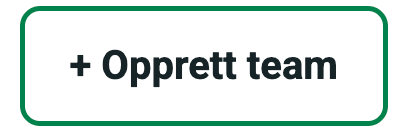{fig-alt="A drawing of an elephant." #fig-dapla-ctrl-opprett-team-button}
:::

::::

Når man oppretter et team må man fylle ut skjemaet i @fig-dapla-ctrl-opprett-team. Under finner du en oversikt hva som er viktig å vurdere når man fyller ut de ulike feltene.

#### Visningsnavn

:::: {.columns}

::: {.column width="45%"}

Visningsnavn er teamets navn i et lesevennlig format. Navnet bør bestå av et **hoveddomenet** og et **subdomenet**. Det er tillatt med små/store bokstaver, mellomrom, **Æ**, **Ø** og **Å**. 

Eksempel på et hoveddomenet i SSB er **Skatt**, og under det finnes det subdomener som **Person** og **Næring**. Visningsnavnet til teamene er da **Skatt Person** og **Skatt Næring**. 

I noen tilfeller gir det ikke mening med et subdomenet og da er det greit å kun ha et hoveddomenet. Et eksempel på et visningsnavn som kun har hoveddomenet er **Nasjonalregnskap**. 

:::

::: {.column width="10%"}
<!-- empty column to create gap -->
:::

::: {.column width="45%"}
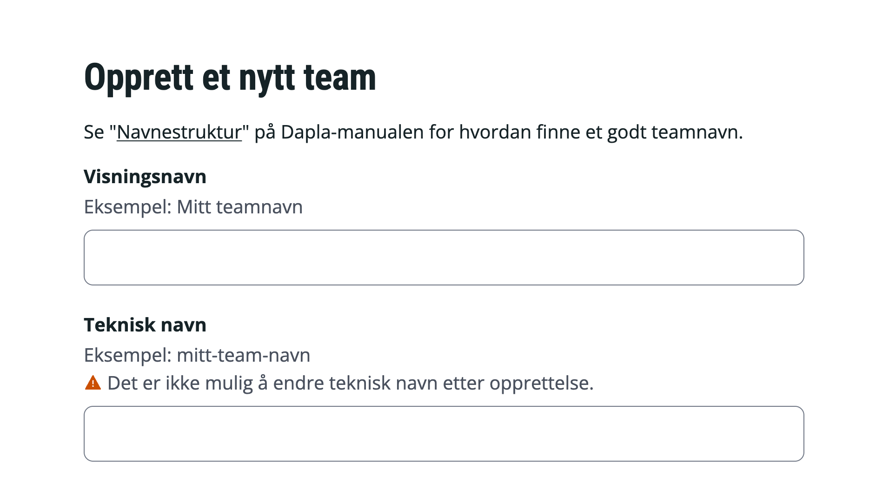{fig-alt="A drawing of an elephant." #fig-dapla-ctrl-opprett-team}
:::

::::

#### Teknisk navn
Teamets navn i et maskinvennlig format som bl.a. benyttes i filstier til lagringsbøtter. Det er ikke tillatt med mellomrom eller norske tegn (Æ, Ø og Å). Navnet kan ikke overskride 17 tegn. @tbl-teamnavn viser noen visningsnavn og tilhørende tekniske navn som er valgt tidligere.

| Visningsnavn            | Teknisk navn  | Overstyrt |
| ----------------------- | ------------- | --------- |
| Skatt Person            | skatt-person  | nei       |
| Skatt Næring            | skatt-naering | nei       |
| Nasjonalregnskap        | nr            | ja        |
| Finansmarkedsstatistikk | finmark       | ja        |
: Eksempler på teamnavn {#tbl-teamnavn .striped}

#### Autonomitetsnivå
Seksjonsledere på avdeling 700 som oppretter et team får også valget om hvilket [autonomitetsnivå](./hva-er-dapla-team.html#Autonomitetsnivå) teamet skal ha. Dette valget er ikke tilgjengelig for andre.  

### Legge til medlemmer

Teamansvarlig for et team er ansvarlig for hvilke medlemmer teamet har, og kan legge til, fjerne og endre medlemmer. I tillegg kan de delegere rettigheten til å tilgangsstyre til andre brukere i SSB (se neste avsnitt). 

Legge til medlemmer i et teamet gjøres ved gå inn på [Teamdetaljer](#teamdetaljer) og **Medlemmer** for det aktuelle teamet. Der vil brukere med ansvar for tilgangsstyring se en boks med tksten **Legg til Medlem**. Dialogboksen som dukker opp vises i @fig-dapla-ctrl-opprett-add-members-site. 

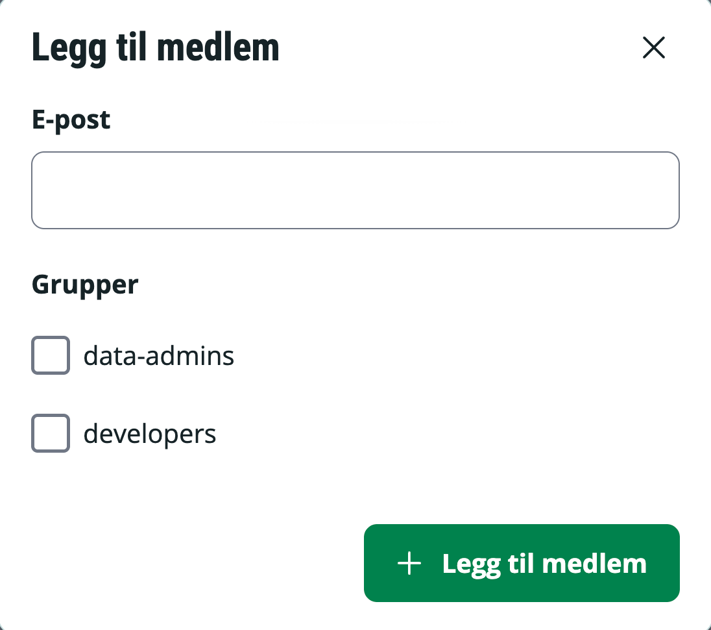{fig-alt="A drawing of an elephant." #fig-dapla-ctrl-opprett-add-members-site}

Der søker man opp den aktuelle brukeren, velger gruppe og trykker **Legg til medlem**. Tilgangen blir da aktivert ila. noen sekunder. 

### Endre eller fjerne medlemmer

Brukere med rettigheten til å tilgangsstyre et team kan endre eller fjerne medlemmer ved å trykke på **pen**-ikonet i tabellen, slik som vist i @fig-dapla-ctrl-change-member-box.

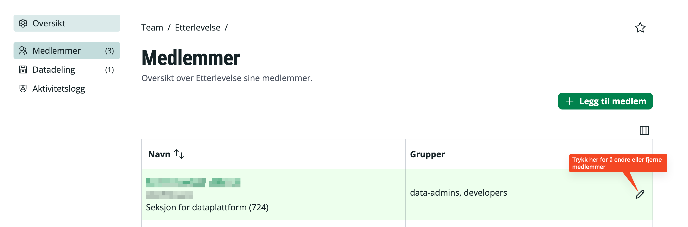{fig-alt="A drawing of an elephant." #fig-dapla-ctrl-change-member-box}

:::: {.columns}

::: {.column width="70%"}

@fig-dapla-ctrl-change-member-box viser dialogboksen som dukker opp. Hvis man ønsker å endre en tilgang så velger man nye tilgangsgrupper og trykker **Lagre**. Hvis man ønsker å slette hele tilgangen så trykker man bare **Fjern fra teamet**. 

:::

::: {.column width="10%"}
<!-- empty column to create gap -->
:::

::: {.column width="20%"}
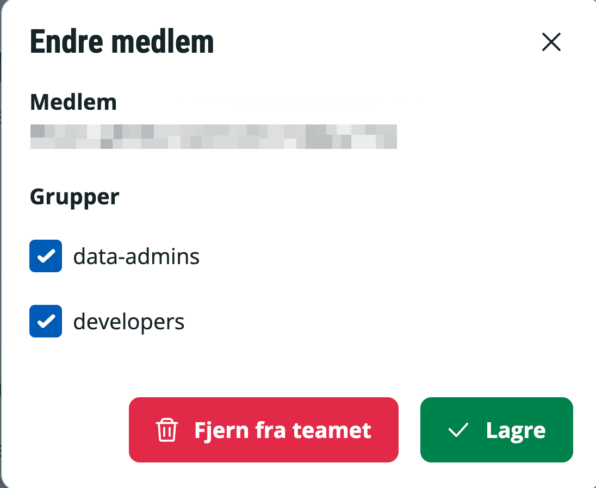{fig-alt="A drawing of an elephant." #fig-dapla-ctrl-change-member-box}
:::

::::

### Endre tilgangsansvarlige

:::: {.columns}

::: {.column width="70%"}

Teamansvarlig for et team kan delegere rettigheten for tilgangsstyring til maksimalt 2 andre SSB-brukere. Delegering gjøres ved at Teamansvarlig går inn på [Teamdetaljer](#teamdetaljer)-siden for teamet, og trukker ➕-ikonet under **Tilgangsansvarlige**. Dialogvinduet som dukker opp vises i @fig-dapla-ctrl-delegate-access. Søk etter brukere basert på kortnavn eller fullt navn og trykk **Legg til**.  

:::

::: {.column width="5%"}
<!-- empty column to create gap -->
:::

::: {.column width="25%"}
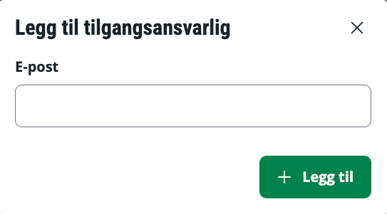{fig-alt="A drawing of an elephant." #fig-dapla-ctrl-delegate-access}
:::

::::

