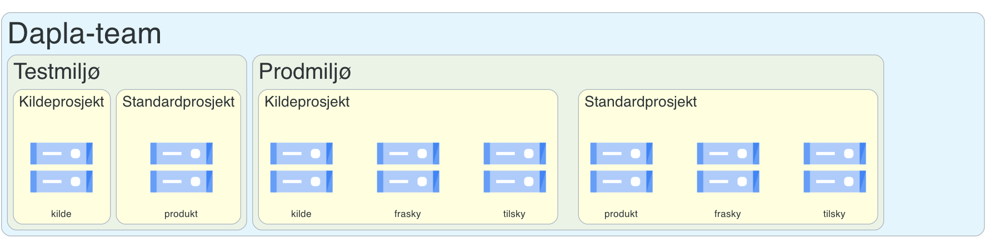

For å kunne jobbe på Dapla må man være en del av et **Dapla-team**. Et Dapla-team er en gruppe personer som har tilgang til spesifikke ressurser på Dapla. Ressursene kan være data, kode eller tjenester. Følgelig er teamet helt sentral for tilgangsstyringen på Dapla. Derfor er det viktig at alle som jobber på Dapla gjør seg godt kjent med innholdet i denne delen.

## Opprette Dapla-team

Alle Dapla-team tilhører en seksjon og opprettes av seksjonslederen i den seksjonen. Dapla-team opprettes i [applikasjonen Dapla-Ctrl](./dapla-ctrl.html#opprette-team). 


## Autonomitetsnivå

Formålet med autonomitetsnivåer er å tydeliggjøre ansvarsfordelingen mellom plattformen og det enkelte team. Ved å skille mellom nivåene kan vi tilby standardiserte løsninger som ivaretar sikkerheten for de fleste, samtidig som vi gir rom for teknisk frihet til team med særskilte behov og høy IT-kompetanse.

Nivået settes når teamet opprettes, men kan endres senere ved behov. Det er kun plattformteamene som kan endre nivået til et team, og gjeldende nivå vises i [Dapla Ctrl](./dapla-ctrl.qmd).


### Managed
Dette er standardløsningen for de fleste team i SSB.

-   **Funksjonalitet:** Teamet benytter ferdig oppsatte tjenester fra plattformen (f.eks. standard lagringsbøtter, [Transfer Service](./transfer-service.html) og [Kildomaten](./kildomaten.html)).
*   **Sikkerhet:** Plattformen garanterer at oppsettet er i tråd med SSBs krav til sikkerhet og forvaltning.
*   **Tilganger:** Teamet benytter de tekniske tilgangsgruppene **data-admins** og **developers**.

### Self-Managed
Dette nivået er for team med behov for utvidet frihet i Google Cloud Platform (GCP).

*   **Funksjonalitet:** Teamet kan ta i bruk GCP-tjenester som ikke tilbys som standard på Dapla, og kan bygge applikasjoner på Nais.
*   **Krav:** Teamet må ha en ansvarlig seksjon på avdeling 700. Dette innebærer at **Teamansvarlig** (seksjonsleder) kommer fra IT-avdelingen. Teamet må også inneha sterk teknisk kompetanse på skyutvikling.
*   **Ansvar:** Siden teamet får bredere tilganger, tar de selv et større ansvar for konfigurasjon, kostnadskontroll og etterlevelse av krav.
*   **Tilganger:** Teamet benytter de tekniske tilgangsgruppene **data-admins** og **developers**, samtidig har de friheten til å opprette andre tilgangsgrupper ved behov.

I resten av dette kapitlet beskrives hovedsakelig funksjonalitet for **Managed** teams.

::: {.callout-note collapse="true"}
## Autonomitetsnivå og tilganger i IaC-repo

Siden hvert team får definert sine ressurser i et eget IaC-repo, er det en nær sammenheng mellom autonomitetsnivå og hvilke endringer teamet kan gjøre selv.

| Egenskap | Managed | Self-Managed |
| :--- | :--- | :--- |
| **Kan lage PR på IaC-kode** | Ja | Ja |
| **Tilgang på IaC-kode** | Kun utvalgte yaml-filer (team-info, iam, etc.) | Full tilgang til repo |
| **Bruk av funksjonalitet utover Dapla-features** | Nei | Ja |
| **IaC-filstruktur** | Predefinert | Fritt oppsett |

: Autonomitet og tilganger i IaC-repo {#tbl-iac-autonomy .striped}

[Les mer om detaljene i dokumentasjonen på Kuben](https://statistics-norway.atlassian.net/wiki/spaces/DAPLA/pages/3667787890/Team+Iac-tilgang+i+Kuben).
:::

## Roller og grupper

Medlemskap i et Dapla-team gir tilgang til spesifikke ressurser. Siden kildedataene til alle team er klassifisert som *sensitive*, kan ikke alle i teamet ha lik tilgang til alle ressurser. For å sikre forsvarlig tilgangsstyring skiller vi mellom den organisatoriske rollen **Teamansvarlig** og de tekniske tilgangsgruppene **developers** og **data-admins**.

### Teamansvarlig

Rollen som *Teamansvarlig* innehas alltid av seksjonslederen ved teamets ansvarlige seksjon. Dette er ikke en teknisk tilgangsgruppe i selve plattformen, men en administrativ rolle med det overordnede ansvaret for teamet.

**Teamansvarlig har ansvar for:**

- At teamet følger SSBs retningslinjer for tilgangsstyring og klassifisering av data.
- Vedlikehold og monitorering av hvem som har tilgang til teamets ressurser.
- At alle i teamet forstår hvordan sensitive data skal behandles.
- Godkjenning av hvem som skal tildeles de tekniske rollene *developers* og *data-admins*.

Rollen som Teamansvarlig krever i seg selv ingen teknisk tilgang til data eller databehandlingstjenester på Dapla.

### Developers

Rollen *developers* er den vanligste tekniske tilgangsgruppen på et Dapla-team. Denne gruppen skal inneholde alle som jobber operativt med data i teamet.

**Medlemmer i developers har tilgang til:**

- Alt av teamets data, med unntak av kildedata.
- Alle ressurser og tjenester som behandler data i tilstandene fra inndata til utdata.
- Teamets felles lagringsbøtter for produkt og deling.

### Data-admins

Rollen *data-admins* er en privilegert teknisk gruppe. Denne skal kun tildeles 2–3 personer i teamet som har et særskilt behov for å administrere kildedata. Personer i denne gruppen er normalt medlem av både *developers*- og *data-admins*-gruppen.

**Medlemmer i data-admins kan gjøre følgende:**

- **JIT-tilgang (Just-In-Time):** De er forhåndsgodkjent til å gi seg selv tidsbegrenset tilgang til kildedata i klartekst ved særskilte behov. Dette krever skriftlig begrunnelse og kan enkelt moniteres av Teamansvarlig. Les mer [her](./appendix/jit.qmd).
- **Automatisering:** De kan godkjenne endringer i automatiske jobber som prosesserer kildedata til inndata.
- **Dataoverføring:** De har fullmakt til å overføre kildedata mellom bakke og sky (Transfer Service).


```{python}
# | echo: false

# Lager et diagram
from diagrams import Cluster, Diagram, Edge
from diagrams.gcp.storage import GCS
from diagrams.generic.storage import Storage
from diagrams.generic.blank import Blank
from PIL import Image

graph_attr_cluster = {
    "fontsize": "20",
    "bgcolor": "lightyellow",
    # "gradientangle": "360"
    # "style": 'filled',
    # "label": "test",
    # "fontcolor": "blue",
}

# Skriver ut en fil som heter dapla-team.png
with Diagram(
    "",
    show=True,
    filename="../images/dapla-team",
    direction="TB",
    graph_attr={"fontsize": "45", "bgcolor": "transparent"},
):
    with Cluster("Dapla-team", graph_attr={"fontsize": "40"}):
        Blank("")

        with Cluster("Testmiljø", graph_attr={"fontsize": "30"}):
            with Cluster("Kildeprosjekt", graph_attr=graph_attr_cluster):
                dkk = GCS("kilde")

            with Cluster("Standardprosjekt", graph_attr=graph_attr_cluster):
                dsp = GCS("produkt")

        with Cluster("Prodmiljø", graph_attr={"fontsize": "30"}):
            with Cluster("Kildeprosjekt", graph_attr=graph_attr_cluster):
                dkk = GCS("kilde")
                dkf = GCS("frasky")
                dkt = GCS("tilsky")

            with Cluster("Standardprosjekt", graph_attr=graph_attr_cluster):
                dsp = GCS("produkt")
                dsf = GCS("frasky")
                dst = GCS("tilsky")

# Cropper bildet så det skal ta mindre plass
# Open the image
img = Image.open("../images/dapla-team.png")

# Define the coordinates for the cropping box
# The box is defined as (left, upper, right, lower)
left = 200
upper = 180
right = 2000
lower = 607
cropping_box = (left, upper, right, lower)

# Crop the image
cropped_img = img.crop(cropping_box)

# Save the cropped image
cropped_img.save("../images/dapla-team-cropped.png")

```

## Ressurser

Når du oppretter et dapla-team så får man en grunnpakke med ressurser som de fleste i SSB vil trenge for å kunne jobbe med data på Dapla. I tillegg kan teamet selvbetjent skru på andre tjenester hvis man ønsker det. I det følgende forklarer vi hva som er inkludert i grunnpakken, og hva som er tilgjengelig for å skru på ved behov.

### Grunnpakken

@fig-team-ressurs viser et overordnet bilde av hvilke ressurser som er inkludert i "*grunnpakken*". Et Dapla-team får et testmiljø og prodmiljø. Det er i prodmiljøet at man jobber med *skarpe* data, mens testmiljøet er forbeholdt arbeid med testdata. I hvert miljø får teamet to Google-prosjekter. Ett for *kildedata* og et for datatilstandene *inndata*, *klargjorte data*, *statistikkdata* og *utdata*. Sistnevnte prosjekt kaller vi for standardprosjektet, siden det er her mesteparten av databehandlingen skjer. 

{fig-alt="Diagram som viser hvilke miljøer, prosjekter og bøtter et team får." #fig-team-ressurs}

Av @fig-team-ressurs ser vi at prosjektene i prodmiljøet får noen flere bøtter enn prosjektene i testmiljøet. Disse ekstrabøttene er forbeholdt synkronisering av data mellom bakke og sky, noe vi ikke legger til rette for i testmiljøet^[Ta kontakt med produkteier for Dapla hvis du trenger å synkronisere testdata mellom bakke og sky]. Les mer om overføring av data mellom bakke og sky [her](./transfer-service.html).

Ressursene som opprettes for et Dapla-team reflekterer i stor grad at kildedata er klassifisert som *sensitive*. Dette er grunnen til at det opprettes et eget prosjekt for kildedata, og at det kun er *data-admins* som potensielt kan få tilgang til dataene her. Opprettelsen av et eget testmiljø skyldes at Dapla-team i større grad enn før forventes å jobbe med testdata istedenfor skarpe data. 

Alle ressursene som opprettes for teamet er definert i tekstfiler i et GitHub-repo. Dette repoet kaller vi for et **IaC-repo** (*Infrastructure as Code*). IaC-repoet er en del av grunnpakken, og er tilgjengelig for alle på teamet. Statistikkere trenger ikke å forholde seg til dette repoet i stor grad, med unntak av når de skal aktivere/deaktivere [features](./features.html) og når de skal sette opp [Kildomaten](./kildomaten.html).


### *Features*

I tillegg til grunnpakken med ressurser, så kan teamet selvbetjent skru på følgende *features* eller tjenester ved behov:

- [Transfer Service](./transfer-service.html) kan skrus på hvis teamet trenger å synkronisere data mellom ulike lagringssystemer. For eksempel mellom bakke og sky, eller mellom to ulike skytjenester.

- [Kildomaten](./kildomaten.html) kan skrus på hvis teamet trenger å automatisere overgangen fra kildedata til inndata.

- [Shared-buckets](./deling-av-data.qmd) kan skrus på hvis teamet trenger å opprette delt-bøtter. 

Foreløpig er det kun disse tre *features* som er tilgjengelig. Det vil komme flere etterhvert som behovene melder seg.

Les mer om features [her]((./features.html)). 

## GitHub-team

Ved opprettelsen av et Dapla-team så blir det også opprettet et tilsvarende GitHub-team med samme navn som Dapla-teamet. Grunnen til at det blir opprettet et GitHub-team er at GitHub er en sentral del av Dapla. Alle ressurser som skal opprettes på plattformen defineres av GitHub-repoer, og vi ønsker at tilganger her også skal reflektere tilgangene på Dapla. 

For eksempel vil et team med navnet **dapla-example** få et GitHub-team med navnet **dapla-example**. Alle som er medlem av Dapla-teamet vil automatisk bli medlem av GitHub-teamet. I tillegg vil gruppetilhørighet og tilgangsroller på GitHub-teamet reflektere tilgangsroller på Dapla-teamet. For eksempel så kan **dapla-example-data-admins** gis tilgang til repo, og da vil alle som er medlem av Dapla-teamet med rollen *data-admins* få tilgang til repoet. Dette benyttes blant annet for å gi teamet tilgang til automation-mappen i sitt IaC-repo. I tillegg kan teamet bruke GitHub-teamet til å gi tilgang til andre GitHub-repoer som er relevante for teamet, for eksempel kodenbasen til en statistikkproduksjon eller lignende. Fordelen er at tilganger er gitt på teamnivå og ikke på personnivå. For eksempel hvis *Teamansvarlig* for teamet fjerner en ansatt fra developers-gruppa, så mister de all tilgang til data, tjenester og kode på GitHub som er tilgjengelig for *developers*. 

## Navnestruktur

Når du oppretter et Dapla-team så må du velge et navn på teamet. Teamet velger selv et navn som reflekterer *domene* og *subdomene*. For eksempel kan et team som jobber med statistikkproduksjonen skattestatistikk for næringslivet velge å kalle teamet **Skatt næring**. Hvis vi bruker dette teamet som et eksempel, så vil det få opprettet et teknisk navn som følger denne strukturen: **skatt-naering**. Dette navnet er det som brukes i tekniske sammenhenger, for eksempel som navn på GitHub-teamet, IaC-repoet, Google-prosjektene og bøttene. @tbl-navn-struktur viser en tabell over hvordan ressursene for dette teamet vil se ut:

| Navn                      | Beskrivelse                                 |
| ------------------------- | ------------------------------------------- |
| skatt-naering             | Teknisk teamnavn                            |
| skatt-naering-data-admins | AD-gruppe for data-admins og et GitHub-team |
| skatt-naering-developers  | AD-gruppe for developers og et GitHub-team  |
| skatt-naering-kilde-p     | Navn på kildeprosjekt i prod                |
| skatt-naering-p           | Navn på standardprosjekt i prod             |
| skatt-naering-kilde-t     | Navn på kildeprosjekt i test                |
| skatt-naering-t           | Navn på standardprosjekt i test             |
: Navnestruktur for teamet **Skatt næring** sine ressurser {#tbl-navn-struktur}

I @tbl-navn-struktur ser vi at teamet får opprettet 2 AD-grupper og 4 Google-prosjekter. AD-gruppene brukes til å gi tilgang til ressursene på Dapla, mens Google-prosjektene brukes til å organisere ressursene. I tillegg er det en fast navnestruktur for bøttene i hvert prosjekt, slikt som vist i @tbl-navn-buckets.

| Prosjektnavn          | Bøttenavn                                |
| --------------------- | ---------------------------------------- |
| skatt-naering-kilde-p | ssb-skatt-naering-data-kilde-prod        |
|                       | ssb-skatt-naering-data-kilde-frasky-prod |
|                       | ssb-skatt-naering-data-kilde-tilsky-prod |
| skatt-naering-p       | ssb-skatt-naering-data-produkt-prod      |
|                       | ssb-skatt-naering-data-frasky-prod       |
|                       | ssb-skatt-naering-data-tilsky-prod       |
| skatt-naering-kilde-t | ssb-skatt-naering-data-kilde-test        |
| skatt-naering-t       | ssb-skatt-naering-data-produkt-test      |
: Navnestruktur for teamet **Skatt næring** sine bøtter {#tbl-navn-buckets}

## Dapla Felles

Alle i SSB er med i *developers*-gruppa til team **Dapla Felles**. Formålet med teamet er gjøre det lett som mulig for alle i SSB å komme-i-gang med Dapla, samtidig som det er et egnet sted for å dele åpne data eller kursmateriell. Teamet har [autonomitetsnivå](./hva-er-dapla-team.qmd#autonomitetsnivå) *managed*, og har de samme bøttene som et vanlig statistikkproduserende team.

Alle i SSB har lese- og skrivetilgang til **produkt**-bøtta til Dapla Felles, og derfor skal det aldri deles data som ikke alle i SSB kan benytte. I tillegg må alle forvente at data her kan slettes og overskrives med jevne mellomrom. 
