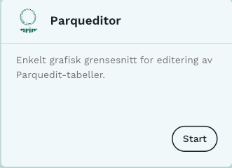

{style="max-width: 35%; float: right;" fig-alt="Parqueditor-tjenesten"}

[**Parqueditor**](https://lab.dapla.ssb.no/launcher/dapla-lab-standard/parqueditor) er en tjeneste på [Dapla Lab](./dapla-lab.qmd) som gir et enkelt grafisk grensesnitt for manuell editering med [Parquedit](./ssb-parquedit.qmd).

Tjenesten er laget for situasjoner der man ønsker å jobbe med Parquedit-tabeller uten å skrive kode selv. Parqueditor passer derfor for enkle arbeidsflyter der brukeren skal finne fram til en rad, oppdatere enkelte felter og lagre endringen med sporbarhet og historikk i Parquedit.

## Forberedelser

Før man starter **Parqueditor** bør man ha lest [kapitlet om Dapla Lab](./dapla-lab.qmd) og satt seg inn i hvordan [Parquedit](./ssb-parquedit.qmd) brukes som lagringsløsning.

For at tjenesten skal være nyttig i praksis må teamet allerede ha tilgang til Parquedit og ha opprettet minst én Parquedit-tabell. Hvis dette ikke er på plass ennå, se [forberedelsene for Parquedit](./ssb-parquedit.qmd#forberedelser).

Deretter gjør du følgende:

1. Logg deg inn på [Dapla Lab](https://lab.dapla.ssb.no/).
2. Under **Tjenestekatalog** trykker du på **Start**-knappen for **Parqueditor**.
3. Gi tjenesten et navn.
4. Velg hvilket team og hvilken tilgangsgruppe du ønsker å representere.
5. Trykk **Start** når du er klar for å starte tjenesten.

## Konfigurasjon

Det viktigste valget i **Parqueditor** er hvilket team og hvilken tilgangsgruppe du representerer når du starter tjenesten.

Dette styrer hvilke bøtter og hvilke Parquedit-tabeller du får tilgang til. For å kunne åpne og editere en tabell må du derfor starte tjenesten med samme teamkontekst som eier tabellen.

Parqueditor følger ellers samme mønster som andre tjenester i Dapla Lab når det gjelder ressurser. 

## Funksjonalitet

Tjenestens formål er å støtte enkle editeringsbehov i Parquedit-tabeller. Den tilbyr et grafisk grensesnitt for å:

- velge en eksisterende Parquedit-tabell eid av teamet
- velge en rad i tabellen, med mulighet for å søke og filtrere på kolonner
- editere verdier i raden og lagre endringene med Parquedit
- se endringshistorikk

Parqueditor er ment som et enkelt brukergrensesnitt over Parquedit. Tjenesten passer derfor best når arbeidsflyten er relativt enkel og hovedbehovet er trygg, manuell oppdatering av enkeltverdier i en tabell.

## Bruksområde

Parqueditor egner seg særlig når:

- data allerede ligger i en Parquedit-tabell
- brukeren ønsker å gjøre manuelle endringer uten å skrive Python-kode
- man vil søke opp og oppdatere enkeltrader
- man vil kunne se hva som er endret i etterkant

Hvis behovet er mer avansert, for eksempel sammensatte arbeidsflyter, egne skjermbilder eller spesialtilpasset validering, vil det ofte være mer aktuelt å bygge et eget grensesnitt mot Parquedit.

## Lagring av arbeid

Selve dataendringene lagres i Parquedit når brukeren oppdaterer en rad. Tjenesten er dermed laget for å jobbe direkte mot den underliggende lagringsløsningen, framfor at brukeren må lagre lokale filer i tjenesten.

## Slette tjenesten

For å slette tjenesten kan man trykke på **Slett**-knappen i Dapla Lab under **Mine tjenester**. Når man sletter en tjeneste, slettes også filsystemet i tjenesten og ressursene frigjøres.

## Pause tjenesten

Man kan pause tjenesten ved å trykke på **Pause**-knappen i Dapla Lab under **Mine tjenester**.

## Monitorering

Man kan monitorere en instans av Parqueditor ved å trykke på tjenesten under **Mine tjenester** i Dapla Lab. Derfra kommer man til overvåkningssiden for tjenesten, med lenker til teknisk informasjon og eksternt dashboard på samme måte som for andre tjenester i Dapla Lab. Se [monitorering i Dapla Lab](./dapla-lab.qmd#monitorering).
