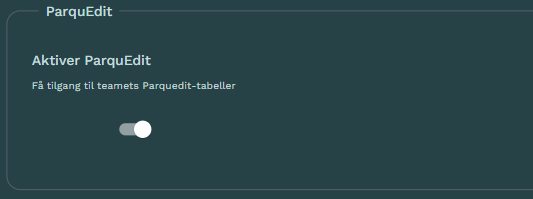

::: {.callout-caution}
## Tjenesten lanseres september 2026

Parquedit lanseres september 2026 og er ikke klar for bruk.
:::


 **Parquedit** er en tjeneste som gir statistikere database-funksjonalitet over Parquet-filer. Formålet med tjenesten er å dekke lagringsbehovene knyttet til arbeid med **manuell editering** av data i SSB. Les mer om [Prinsipper og retningslinjer for dataeditering i SSB](https://www.ssb.no/teknologi-og-innovasjon/informasjons-og-kommunikasjonsteknologi-ikt/artikler/prinsipper-og-retningslinjer-for-dataeditering). 
 
 **Parquedit** inkluderer IKKE et grafisk grensesnitt (GUI) for å gjøre manuelle endringer på data, kun en enkel Python-funksjon som oppdaterer informasjon i en rad i et datasett. Parquedit kan derimot benyttes som en underliggende lagringsløsning som oppdateres via GUI'er som [Editeringsrammeverket](./editeringsrammeverk.qmd) eller andre løsninger. 

**ssb-parquedit** er bygget på [Ducklake](https://ducklake.select/) og har følgende egenskaper:

- versjonering av data
- tidsreiser
- flere samtidige brukere (*concurrency*)
- [ACID](https://en.wikipedia.org/wiki/ACID-transaksjoner)-transaksjoner 
- logging av endringer
    - hva ble endret?
    - hvem endret?
    - hvorfor ble det endret?


Tjenesten lagrer data i statistikkteamets produktbøtte, mens metadata lagres i en sentral katalog på Dapla. Teamene kan benytte seg av Python-pakken [ssb-parquedit](https://pypi.org/project/ssb-parquedit/) for å jobbe med Parquedit-tabellen sine fra [Dapla Lab](./dapla-lab.qmd).  


:::{.callout-note collapse="true"}
## TL;DR ⏱️ Hurtigstart

1. Installer pakken i prosjektet ditt:
```{.bash filename="Terminal"}
poetry add ssb-parquedit
```

2. Opprett en klient og se data:
```{.python filename="Notebook"}
from ssb_parquedit import ParquEdit

con = ParquEdit()
con.view(table_name="manuell_tabell", limit=5)
```

3. Oppdater en rad med begrunnelse:
```{.python filename="Notebook"}
row = con.view(table_name="manuell_tabell", where="enhet_id = '12345'")
rowid = row["rowid"].iloc[0]

con.edit(
    table_name="manuell_tabell",
    rowid=rowid,
    changes={"status": "GODKJENT"},
    change_event_reason="REVIEW",
    change_comment="Manuell kvalitetssikring",
)
```
:::

## Bruksområde

Parquedit er ment som et **midlertidig lagringsformat** under arbeidsprosessen for manuell editering. Tjenesten forutsetter at brukeren ønsker å oppdatere en og en rad etter manuelle vurderinger av en person, og at dette skjer etter maskinelle kontroller og rettinger er gjennomført. Tjenesten forutsetter også at oppdateringer skjer i en enkelttabell. Parquedit har ikke støtte for *primary* eller *foreign* nøkler.  

Når arbeidsprosessen med manuell editering er gjennomført og data lagres i stabile datatilstander, så forutsetter systemet at teamet som eier dataene selv henter ut opplysninger fra Parquedit med logger som skal benyttes til kvalitetsrapporter og gi evnen til å gjenskape manuelle editeringer på et senere tidspunkt.     

## Forberedelser

For at et team skal kunne benytte seg av Parquedit må [Teamansvarlig](./hva-er-dapla-team.qmd#teamansvarlig) først aktivere tilgang i Dapla Ctrl. Det gjøres på følgende måte:

1. Gå inn i [Dapla Ctrl](https://dapla-ctrl.intern.ssb.no/)
2. Åpne **Instillinger** på Teamsiden
3. Under **Parquedit** velger du **Aktiver tilgang**

Etter dette kan teamets medlemmer opprette så mange Parquedit-tabeller de ønsker. 

Et team som har aktivert tilgangen kan åpne en tjeneste i Dapla Lab. For at ParquEdit skal kunne benyttes sammen med andre løsninger som benytter Postgres, må man aktivere Parquedit-tilgang under **Avansert** når man setter opp tjenesten:





og installere Python-pakken [ssb-parquedit](https://pypi.org/project/ssb-parquedit/) i et [ssb-project](./ssb-project.qmd) på følgende måte:

```{.python filename="Terminal"}
poetry add ssb-parquedit
```

## Funksjonalitet

Under beskrives funksjonaliteten som tilbys av Parquedit. Vanlig funksjonalitet tilbys som funksjoner i Python-biblioteket [ssb-parquedit](https://pypi.org/project/ssb-parquedit/). 

### Opprette kobling

For å jobbe med Parquedit-tabeller må man første opprette en kobling. Opprett en standardkobling på følgende måte: 

```{.python filename="Notebook"}
from ssb_parquedit import ParquEdit

con = ParquEdit()
```

Avanserte brukere kan også konfigurere sin egen kobling til Parquedit. Det beskrives nærmere senere. 

### Opprette ny tabell

Man kan opprette en ny Parquedit-tabell basert på følgende input:

- Parquet-fil
- Dataframe i minnet (Pandas, Polars, etc.)
- json-skjema


::: {.panel-tabset}

## Parquet

```{.python filename="Notebook"}
# Opprett fra eksisterende Parquet-fil i GCS (skjema utledes fra filen)
con.create_table(
    table_name="manuell_tabell_gcs",
    source="gs://my-bucket/path/to/file.parquet",
    product_name="eksempelprodukt",
    user_defined_id=["enhet_id", "aar"],
)
```

## Dataframe

```{.python filename="Notebook"}
import pandas as pd

df = pd.DataFrame(
    {
        "enhet_id": ["A1", "A2"],
        "aar": [2025, 2025],
        "status": ["NY", "NY"],
    }
)

con.create_table(
    table_name="manuell_tabell",
    source=df,
    product_name="eksempelprodukt",
    user_defined_id=["enhet_id", "aar"],
    fill=True,
)
```

:::

Følgende argumenter må oppgis ved opprettelse av ny tabell:

`table_name` er det navnet på tabellen du ønsker å opprette. Siden et team kan ha flere tabeller, er det dette navnet som benyttes senere for å referere til tabellen. 

`source` er kilden (Parquet, Dataframe eller json-skjema) som skal benyttes til å opprette tabellen.

`product_name` er obligatorisk og lagres som en kommentar på tabellen. Tabellnavn må være lowercase, starte med bokstav eller underscore, kun inneholde lowercase-bokstaver, tall og underscore, og være maks 20 tegn.

`user_defined_id` er en liste med kolonner som til sammen unikt identifiserer en rad, tilsvarende en primærnøkkel.


#### Partisjonert tabeller


```{.python filename="Notebook"}
# Opprett partisjonert tabell og fyll med data
con.create_table(
    table_name="manuell_tabell_partisjonert",
    source=df,
    product_name="eksempelprodukt",
    part_columns=["aar"],
    user_defined_id=["enhet_id"],
    fill=True,
)
```

### Laste data

```{.python filename="Notebook"}
con.insert_data(
    table_name="manuell_tabell",
    source=df,
)
```

### Lese data

```{.python filename="Notebook"}
# Hent alle rader (pandas DataFrame)
df = con.view(table_name="manuell_tabell")

# Filter og velg kolonner
utvalg = con.view(
    table_name="manuell_tabell",
    where="aar = 2025",
    columns=["enhet_id", "status", "verdi"],
    order_by="enhet_id ASC",
)
```

```{.python filename="Notebook"}
# Alle rader (returnerer pandas DataFrame som standard)
result = con.view("manuell_tabell")

# Filtrering med WHERE-betingelse
result = con.view("manuell_tabell", where="aar = 2025")
result = con.view("manuell_tabell", where="enhet_id = 'A1' AND aar >= 2025")

# Velg spesifikke kolonner
result = con.view("manuell_tabell", columns=["enhet_id", "aar"])

# Sorter resultater
result = con.view("manuell_tabell", order_by="aar DESC")

# Returner som polars eller pyarrow
result = con.view("manuell_tabell", output_format="polars")
result = con.view("manuell_tabell", output_format="pyarrow")
```


### Editering

En vanlig flyt er:

1. Finn riktig rad og les ut `rowid`.
2. Kall `edit()` med nye verdier for raden identifisert med `rowid`.
3. Oppgi årsak (`change_event_reason`) og kommentar (`change_comment`).

```{.python filename="Notebook"}
# 1) Finn raden som skal endres
rad = con.view(
    table_name="manuell_tabell",
    where="enhet_id = 'A1' AND aar = 2025",
)
rowid = rad["rowid"].iloc[0]

# 2) Oppdater verdier på raden
con.edit(
    table_name="manuell_tabell",
    rowid=rowid,
    changes={"status": "KORRIGERT"},
    change_event_reason="REVIEW",
    change_comment="Endret etter intern kontroll",
)
```

`changes` er en ordbok (`dict`) med par på formen `{kolonnenavn: ny_verdi}`.

Gyldige verdier for `change_event_reason` er:

- `OTHER_SOURCE`
- `REVIEW`
- `OWNER`
- `MARGINAL_UNIT`
- `DUPLICATE`
- `OTHER`

### Sletting av rader
For å slette rader fra en tabell kaller man `delete_row()` med `where` for å identifisere raden(e) som skal fjernes.
```{.python filename="Notebook"}
con.delete_row(
    table_name="manuell_tabell",
    where="enhet_id = 'A1' AND aar = 2025",
    change_event_reason="REVIEW",
    change_comment="Slettet etter intern kontroll")
```
Sletting av rader krever at man oppgir både `change_event_reason` og `change_comment` for å dokumentere hvorfor raden(e) ble fjernet.
Gyldige verdier for `change_event_reason` er:

- `OTHER_SOURCE`
- `REVIEW`
- `OWNER`
- `MARGINAL_UNIT`
- `DUPLICATE`
- `OTHER`

Sletting av flere rader logges som en hendelse i endringsloggen. `get_edits()` vil vise hvor mange rader som ble påvirket og hvilken `where`-betingelse som ble brukt.

### Lese logger

Bruk `get_edits()` for å hente historikk over manuelle endringer.

```{.python filename="Notebook"}
# Endringer for en tabell
logg = con.get_edits(table_name="manuell_tabell")

# Alternativt alle tabeller
alle_endringer = con.get_edits()
```

Dette gir blant annet:

- hvem som gjorde endringen
- tidspunkt for endringen
- begrunnelse og kommentar
- gamle og nye verdier
- endringstype (UPDATE/DELETE)
- `where`-betingelsen som ble brukt ved sletting av rad(er)
- hvor mange rader som ble påvirket av endringen

### Liste tabeller

Liste ut alle tabeller som tilhører teamet: 

```{.python filename="Notebook"}
tabeller = con.list_tables()
```


### Antall rader i en tabell

```{.python filename="Notebook"}
con.count(table_name="manuell_tabell")
```

### Sjekk av eksistens

```{.python filename="Notebook"}
con.exists(table_name="manuell_tabell")
```

## Vedlikehold

### Slette tabell

Gjør følgende for å fjerne tabellen fra den sentrale katalogen, slette editeringshistorikk og filene i teamets bøtte: 

```{.python filename="Notebook"}
con.drop_table("manuell_tabell", cleanup=True)
```

Hvis man ønsker å beholde editeringshistorikk og selve datafilene i produktbøtta, legger man til `cleanup=False` på denne måten:

```{.python filename="Notebook"}
con.drop_table("manuell_tabell", cleanup=False)
```

### Flush av inlinede data
Flush av inlinede data materialiserer inlinede rader til Parquet-filer for en tabell. Dette er en vedlikeholdsoperasjon for arbeidsflyter med hyppige, små skriveoperasjoner, og bidrar til å holde lagringsstrukturen effektiv og spørreytelsen stabil. Operasjonen endrer ikke tabellverdiene, kun hvordan dataene er fysisk lagret. Operasjonen er trygg å kjøre gjentatte ganger: Å kjøre den når det ikke er noe ventende har ingen effekt.

```{.python filename="Notebook"}
# Flusher inlinede data for tabellen 'manuell_tabell'
con.flush_inlined_table(table_name="manuell_tabell")
```

### Merge adjacent files
Å slå sammen tilstøtende filer komprimerer en tabells små Parquet-filer til færre, større filer. Dette er et vedlikeholdssteg for tabeller som mottar mange små skriveoperasjoner, som forbedrer skanneeffektiviteten og reduserer overhead ved filhåndtering. Operasjonen bevarer tabelldata og historikksemantikk, og endrer kun det fysiske fillayoutet. Operasjonen er trygg å kjøre gjentatte ganger: Å kjøre den når ingenting kan slås sammen har ingen effekt.

```{.python filename="Notebook"}
# Slår sammen tilstøtende filer for tabellen 'manuell_tabell'
con.merge_adjacent_files(table_name="manuell_tabell")
```

### Eksporter katalog
`export_catalog()` tar sikkerhetskopi av DuckLake-metadatakatalogen. Den flusher og slår sammen inlinede data for alle tabeller, og kopierer deretter alle tabeller fra det PostgreSQL-baserte katalogskjemaet inn i en DuckDB-fil, som lastes opp til GCS. Returnerer hele GCS-stien (inkludert filnavn) til den eksporterte sikkerhetskopien.

```{.python filename="Notebook"}
# Eksporter med standard sti ({data_path}/catalog-export)
con.export_catalog()

# Eksporter til en egendefinert GCS-sti
con.export_catalog(export_path="gs://bucket/backups")
```

### Importer katalog
`import_catalog()` gjenoppretter DuckLake-metadatakatalogen fra en sikkerhetskopifil produsert av `export_catalog()`. For hver tabell som finnes i sikkerhetskopien, blir eksisterende rader i katalogen slettet og erstattet med de sikkerhetskopierte radene.

```{.python filename="Notebook"}
# Gjenopprett katalogen fra en sikkerhetskopifil
con.import_catalog(backup_file_path="gs://bucket/backups/20250101_120000_my_schema.duckdb")
```

## Avansert

### Sette opp lokal tilkobling
Opprett en ParquEdit-instans støttet av en persistent lokal SQLite-katalog. Nyttig for lokal utvikling og testing uten tilgang til GCS eller PostgreSQL. Katalogen og datafilene lagres på `path` og består mellom økter. Mappen opprettes hvis den ikke allerede finnes.

```{.python filename="Notebook"}
con = ParquEdit().local(path="/home/onyxia/work/")
```

### Få tilgang til den underliggende DuckDB-tilkoblingen
ParquEdit pakker inn en `DuckDBConnection`, som eksponerer den underliggende `duckdb.DuckDBPyConnection` via `.raw`-egenskapen. Dette er nyttig når man integrerer med biblioteker som krever en nativ DuckDB-tilkobling, som Ibis.

```{.python filename="Notebook"}
import ibis
from ssb_parquedit import ParquEdit

con = ParquEdit()
raw = con._get_connection().raw  # duckdb.DuckDBPyConnection

ibis_conn = ibis.duckdb.connect(conn=raw)
table = ibis_conn.table("manuell_tabell")
```

Merk:

- `_get_connection()` er en intern metode. Den underliggende tilkoblingen deler tilstand med ParquEdit — å lukke den ene påvirker den andre. Ikke lukk den underliggende tilkoblingen manuelt mens ParquEdit fortsatt er i bruk.
- Ved bruk av den underliggende tilkoblingen er det brukerens ansvar å oppgi den informasjonen som ParquEdit-metodene ellers gir. F.eks. ved oppretting og redigering av tabeller.


### Gjenopprette en lokal katalogsikkerhetskopi med GCS-data
`ParquEdit.local_with_gcs_data()` kobler til en lokal DuckDB-katalogfil (f.eks. en produsert av `export_catalog()`), mens selve Parquet-dataene fortsatt ligger på GCS. Nyttig for å inspisere eller gjenopprette fra en DuckLake-katalogsikkerhetskopi uten behov for en aktiv PostgreSQL-tilkobling. Må brukes i DaplaLab for å få tilgang til GCS-bøtter.

```{.python filename="Notebook"}
con = ParquEdit.local_with_gcs_data(catalog_path="localcopy.duckdb")
```
