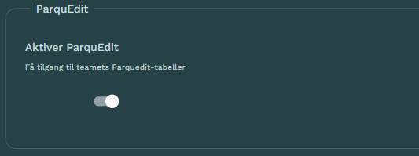

:::{.callout-note}
I Oktober 2026 lanseres det en tjeneste som kan brukes til å lage sine egne dashboard/applikasjoner.
Denne tjenesten er et eksempel på hva man vil kunne lage.
:::

 [**Parqueditor**](https://lab.dapla.ssb.no/launcher/dapla-lab-standard/parqueditor) er en tjeneste som gir et enkelt grafisk grensesnitt for manuell editering med [Parquedit](./ssb-parquedit.qmd). 
 
 Tjenestens formål er å støtte enkle editeringsbehov.

 :::{.callout-note collapse="true"}
## TL;DR ⏱️ Hurtigstart

1. Åpne [Parqueditor-tjenesten](https://lab.dapla.ssb.no/launcher/dapla-lab-standard/parqueditor).

2. Velg temaet som eier Parquedit-tabellen(e) du ønsker å editere.

   

3. Start tjenesten.

:::

## Funksjonalitet

Tjenesten har et grafisk grensesnitt med mulighet for:

* Velge eksisterende Parquedit-tabell for et team
* Velge én rad med mulighet for å søke og filtrere på kolonner
* Editere verdier for valgt rad og lagre endringer med Parquedit
* Se endringshistorikk

