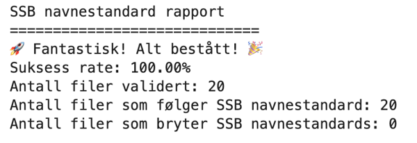

Modulen `standards` i [dapla-toolbelt-metadata](https://pypi.org/project/dapla-toolbelt-metadata/) tilbyr metoder for å lage filstier og sjekke om filer i bøtter er i tråd med SSBs definerte [navnestandard](./navnestandard.qmd). Metodene inkluderer:

- Generere komplette eller deler av filstier som følger navnestandarden
- Validere at bøtter, mapper og filer eksisterer
- Validere at filstier som ikke eksisterer følger navnestandard^[Når man validerer en filsti som ikke eksisterer så får man beskjed om at `Filen eksisterer ikke. Validerer uansett.`.]
- Informasjon om hva som bryter med navnestandarden.

For å effektivisere validering av bøtter med store mengder filer, benytter metoden asynkronitet.

## Funksjonalitet

`standards` tilbyr tre typer funksjonalitet. Du kan generere filstier som følger navnestandarden, sjekke om en bøtte, mappe eller fil følger standarden, og produsere en rapport som oppsummerer resultatet av valideringen.

### Generere filstier

Funksjonen `create_dataset_path()` setter sammen og validerer en filsti fra informasjon om datasettet. For å lage en komplett filsti oppgir du bøttenavn, produktkortnavn, datatilstand og delene som skal inngå i filnavnet:

```{.python filename="Notebook"}
from dapla_metadata.standards import DataState, FileType, create_dataset_path

path = create_dataset_path(
	bucket="ssb-dapla-example-data-produkt-prod",
	product="ledstill",
	data_state=DataState.OUTPUT_DATA,
	short_description="varehandel",
	period_from="2018-Q1",
	version=3,
	file_type=FileType.PARQUET,
)
path
```

```{.python}
'gs://ssb-dapla-example-data-produkt-prod/ledstill/utdata/varehandel_p2018-Q1_v3.parquet'
```

Hvis datasettet dekker et tidsintervall, kan du også oppgi `period_to`. Egendefinerte mapper under datatilstanden oppgis som en liste i `folders`:

```{.python filename="Notebook"}
path = create_dataset_path(
	bucket="ssb-dapla-example-data-produkt-prod",
	product="ledstill",
	data_state=DataState.PROCESSED_DATA,
	folders=["dapla", "revidert"],
	short_description="ufo-observasjoner",
	period_from="2019",
	period_to="2020",
	version=2,
	file_type=FileType.CSV,
)
path
```

```{.python}
'gs://ssb-dapla-example-data-produkt-prod/ledstill/klargjorte-data/dapla/revidert/ufo-observasjoner_p2019_p2020_v2.csv'
```

Du kan også generere bare filnavnet eller en sammenhengende del av filstien. Dette kan for eksempel brukes når bøttenavnet legges til et annet sted i koden:

```{.python filename="Notebook"}
filename = create_dataset_path(
	short_description="befolkning",
	period_from="2025",
	version=1,
	file_type=FileType.JSON,
)

relative_path = create_dataset_path(
	product="ledstill",
	data_state=DataState.INPUT_DATA,
)

print(filename)
print(relative_path)
```

```{.python}
befolkning_p2025_v1.json
ledstill/inndata
```

Følgende filtyper støttes: `FileType.PARQUET`, `FileType.CSV`, `FileType.JSON` og `FileType.XML`.

Datatilstand oppgis med `DataState`: `DataState.INPUT_DATA` (`inndata`), `DataState.PROCESSED_DATA` (`klargjorte-data`), `DataState.STATISTICS` (`statistikk`) og `DataState.OUTPUT_DATA` (`utdata`). Kildedata er ikke støttet, fordi filnavn i `kildedata` ikke er omfattet av navnestandarden.

Periodene `period_from` og `period_to` støtter disse formatene: år (`2019`), måned (`2022-10`), dato (`2022-01-24`), ISO-uke (`2020-W15`), ISO-dagnummer (`2022-015`), dato og tid (`2024-12-31T23-59-30.000`), samt SSBs perioder for to måneder (`2024-B1`), kvartal (`2024-Q1`), tertial (`2024-T1`) og halvår (`2024-H1`).

::: {.callout-important}
## Oppgi verdier uten syntaksen fra navnestandarden

Oppgi kun selve verdiene til funksjonen. `create_dataset_path()` legger selv til `gs://`, prefiksene `p` og `v`, skilletegn og filendelse. Bruk derfor for eksempel `period_from="2018-Q1"`, `version=1` og `file_type=FileType.PARQUET` ikke `p2018-Q1`, `v1` eller `".parquet"`.

`data_state` og `file_type` må oppgis som enum-medlemmer, ikke som tekst. `data_state="utdata"` gir en `TypeError`.

Alle delene av et filnavn må oppgis samlet: `short_description`, `period_from`, `version` og `file_type`. En delvis filsti må også være sammenhengende. Du kan for eksempel generere `product/data_state`, men ikke kombinere `bucket` og `data_state` uten å oppgi `product`.
:::

Funksjonen validerer blant annet datatilstand, periodeformat, kronologisk rekkefølge, versjonsnummer og tegn i mappe og filnavn. Ugyldige verdier gir en `TypeError` eller `ValueError`. Funksjonen oppretter ikke mapper eller filer og kontrollerer ikke om filstien finnes i GCS.

### Validering

For å sjekke om en bøtte, mappe eller fil følger navnestandarden kan man benytte funksjonen `check_naming_standard()`. Den returnerer en liste med resultater for alle objektene du har bedt om å få validert.


```{.python filename="Notebook"}
from dapla_metadata.standards.standard_validators import check_naming_standard

results = await check_naming_standard("<bøttenavn/mappe/filsti>")
results
```
::: {.callout-caution collapse="true"}
## Output fra validering av enkeltfil

```{.python}
ValidationResult(
    success=False, 
    file_path="/buckets/produkt/stat/inndata/bil_v1.parquet", 
    messages=[
        "Det er oppdaget brudd på SSB-navnestandard:"
    ], 
    violations=[
        "Filnavn mangler gyldighetsperiode ref: https://manual.dapla.ssb.no/statistikkere/navnestandard.html#filnavn"
    ]
)
```
:::

Siden metoden bruker asynkrone kall, må nøkkelordet `await` brukes foran metodenavnet.

For å få tilgang til spesifikke deler av resultatet, kan du bruke punktnotasjon `.`. Hvis du for eksempel ønsker å hente ut listen med regelbrudd fra det første valideringsresultatet, kan du gjøre følgende:

```{.python}
results[0].violations
```

Hvis du har validert et stort antall filer så kan du benytte følgende kode for å få ut resultatene på en mer lesbar form:

```{.python filename="Notebook"}
violations = [r for r in results if not r.success]

if not violations:
    print("Gratulerer, ingen feil å vise")
else:
    for v in violations:
        print(v.file_path)
        print("\t" + "\n\t".join(v.messages))
        print("\t\t" + "\n\t\t".join(v.violations) + "\n")
```

::: {.callout-caution collapse="true"}
## Eksempel på output fra validering av mange filer

```{.python}
gs://ssb-dapla-felles-data-produkt-prod/GIS/testdata/butikker_kongsvinger.parquet
	Det er oppdaget brudd på SSB-navnestandard:
		Mappe for datatilstand mangler ref: https://manual.dapla.ssb.no/statistikkere/navnestandard.html#obligatoriske-mapper
		Filnavn mangler gyldighetsperiode ref: https://manual.dapla.ssb.no/statistikkere/navnestandard.html#filnavn
		Filnavn mangler versjon ref: https://manual.dapla.ssb.no/statistikkere/navnestandard.html#filnavn

gs://ssb-dapla-felles-data-produkt-prod/GIS/testdata/butikkbygg_kongsvinger.parquet
	Det er oppdaget brudd på SSB-navnestandard:
		Mappe for datatilstand mangler ref: https://manual.dapla.ssb.no/statistikkere/navnestandard.html#obligatoriske-mapper
		Filnavn mangler gyldighetsperiode ref: https://manual.dapla.ssb.no/statistikkere/navnestandard.html#filnavn
		Filnavn mangler versjon ref: https://manual.dapla.ssb.no/statistikkere/navnestandard.html#filnavn

gs://ssb-dapla-felles-data-produkt-prod/GIS/testdata/butikkbygg_oslo.parquet
	Det er oppdaget brudd på SSB-navnestandard:
		Mappe for datatilstand mangler ref: https://manual.dapla.ssb.no/statistikkere/navnestandard.html#obligatoriske-mapper
		Filnavn mangler gyldighetsperiode ref: https://manual.dapla.ssb.no/statistikkere/navnestandard.html#filnavn
		Filnavn mangler versjon ref: https://manual.dapla.ssb.no/statistikkere/navnestandard.html#filnavn

gs://ssb-dapla-felles-data-produkt-prod/GIS/testdata/noen_boliger_kongsvinger.parquet
	Det er oppdaget brudd på SSB-navnestandard:
		Mappe for datatilstand mangler ref: https://manual.dapla.ssb.no/statistikkere/navnestandard.html#obligatoriske-mapper
		Filnavn mangler gyldighetsperiode ref: https://manual.dapla.ssb.no/statistikkere/navnestandard.html#filnavn
		Filnavn mangler versjon ref: https://manual.dapla.ssb.no/statistikkere/navnestandard.html#filnavn

gs://ssb-dapla-felles-data-produkt-prod/GIS/testdata/noen_boliger_oslo.parquet
	Det er oppdaget brudd på SSB-navnestandard:
		Mappe for datatilstand mangler ref: https://manual.dapla.ssb.no/statistikkere/navnestandard.html#obligatoriske-mapper
		Filnavn mangler gyldighetsperiode ref: https://manual.dapla.ssb.no/statistikkere/navnestandard.html#filnavn
		Filnavn mangler versjon ref: https://manual.dapla.ssb.no/statistikkere/navnestandard.html#filnavn

gs://ssb-dapla-felles-data-produkt-prod/GIS/testdata/butikker_oslo.parquet
	Det er oppdaget brudd på SSB-navnestandard:
		Mappe for datatilstand mangler ref: https://manual.dapla.ssb.no/statistikkere/navnestandard.html#obligatoriske-mapper
		Filnavn mangler gyldighetsperiode ref: https://manual.dapla.ssb.no/statistikkere/navnestandard.html#filnavn
		Filnavn mangler versjon ref: https://manual.dapla.ssb.no/statistikkere/navnestandard.html#filnavn

gs://ssb-dapla-felles-data-produkt-prod/GIS/testdata/noen_boligbygg_oslo.parquet
	Det er oppdaget brudd på SSB-navnestandard:
		Mappe for datatilstand mangler ref: https://manual.dapla.ssb.no/statistikkere/navnestandard.html#obligatoriske-mapper
		Filnavn mangler gyldighetsperiode ref: https://manual.dapla.ssb.no/statistikkere/navnestandard.html#filnavn
		Filnavn mangler versjon ref: https://manual.dapla.ssb.no/statistikkere/navnestandard.html#filnavn

gs://ssb-dapla-felles-data-produkt-prod/GIS/testdata/noen_boligbygg_kongsvinger.parquet
	Det er oppdaget brudd på SSB-navnestandard:
		Mappe for datatilstand mangler ref: https://manual.dapla.ssb.no/statistikkere/navnestandard.html#obligatoriske-mapper
		Filnavn mangler gyldighetsperiode ref: https://manual.dapla.ssb.no/statistikkere/navnestandard.html#filnavn
		Filnavn mangler versjon ref: https://manual.dapla.ssb.no/statistikkere/navnestandard.html#filnavn

gs://ssb-dapla-felles-data-produkt-prod/GIS/testdata/NVE_Trafostasjon_punkt_p2023.parquet
	Det er oppdaget brudd på SSB-navnestandard:
		Mappe for datatilstand mangler ref: https://manual.dapla.ssb.no/statistikkere/navnestandard.html#obligatoriske-mapper
		Filnavn mangler versjon ref: https://manual.dapla.ssb.no/statistikkere/navnestandard.html#filnavn

gs://ssb-dapla-felles-data-produkt-prod/GIS/testdata/enkle_kommuner.parquet
	Det er oppdaget brudd på SSB-navnestandard:
		Mappe for datatilstand mangler ref: https://manual.dapla.ssb.no/statistikkere/navnestandard.html#obligatoriske-mapper
		Filnavn mangler gyldighetsperiode ref: https://manual.dapla.ssb.no/statistikkere/navnestandard.html#filnavn
		Filnavn mangler versjon ref: https://manual.dapla.ssb.no/statistikkere/navnestandard.html#filnavn

gs://ssb-dapla-felles-data-produkt-prod/GIS/testdata/bygg_kongsvinger.parquet
	Det er oppdaget brudd på SSB-navnestandard:
		Mappe for datatilstand mangler ref: https://manual.dapla.ssb.no/statistikkere/navnestandard.html#obligatoriske-mapper
		Filnavn mangler gyldighetsperiode ref: https://manual.dapla.ssb.no/statistikkere/navnestandard.html#filnavn
		Filnavn mangler versjon ref: https://manual.dapla.ssb.no/statistikkere/navnestandard.html#filnavn

gs://ssb-dapla-felles-data-produkt-prod/GIS/testdata/veger_kongsvinger.parquet
	Det er oppdaget brudd på SSB-navnestandard:
		Mappe for datatilstand mangler ref: https://manual.dapla.ssb.no/statistikkere/navnestandard.html#obligatoriske-mapper
		Filnavn mangler gyldighetsperiode ref: https://manual.dapla.ssb.no/statistikkere/navnestandard.html#filnavn
		Filnavn mangler versjon ref: https://manual.dapla.ssb.no/statistikkere/navnestandard.html#filnavn

gs://ssb-dapla-felles-data-produkt-prod/GIS/testdata/noen_tettsteder_2023.parquet
	Det er oppdaget brudd på SSB-navnestandard:
		Mappe for datatilstand mangler ref: https://manual.dapla.ssb.no/statistikkere/navnestandard.html#obligatoriske-mapper
		Filnavn mangler gyldighetsperiode ref: https://manual.dapla.ssb.no/statistikkere/navnestandard.html#filnavn
		Filnavn mangler versjon ref: https://manual.dapla.ssb.no/statistikkere/navnestandard.html#filnavn

gs://ssb-dapla-felles-data-produkt-prod/GIS/testdata/bygg_oslo.parquet
	Det er oppdaget brudd på SSB-navnestandard:
		Mappe for datatilstand mangler ref: https://manual.dapla.ssb.no/statistikkere/navnestandard.html#obligatoriske-mapper
		Filnavn mangler gyldighetsperiode ref: https://manual.dapla.ssb.no/statistikkere/navnestandard.html#filnavn
		Filnavn mangler versjon ref: https://manual.dapla.ssb.no/statistikkere/navnestandard.html#filnavn

gs://ssb-dapla-felles-data-produkt-prod/GIS/testdata/veger_oslo.parquet
	Det er oppdaget brudd på SSB-navnestandard:
		Mappe for datatilstand mangler ref: https://manual.dapla.ssb.no/statistikkere/navnestandard.html#obligatoriske-mapper
		Filnavn mangler gyldighetsperiode ref: https://manual.dapla.ssb.no/statistikkere/navnestandard.html#filnavn
		Filnavn mangler versjon ref: https://manual.dapla.ssb.no/statistikkere/navnestandard.html#filnavn

gs://ssb-dapla-felles-data-produkt-prod/GIS/testdata/ABAS_kommune_flate_p2024_v1.parquet
	Det er oppdaget brudd på SSB-navnestandard:
		Mappe for datatilstand mangler ref: https://manual.dapla.ssb.no/statistikkere/navnestandard.html#obligatoriske-mapper

gs://ssb-dapla-felles-data-produkt-prod/GIS/testdata/SSB_tettsted_flate_p2022_v1.parquet
	Det er oppdaget brudd på SSB-navnestandard:
		Mappe for datatilstand mangler ref: https://manual.dapla.ssb.no/statistikkere/navnestandard.html#obligatoriske-mapper

gs://ssb-dapla-felles-data-produkt-prod/GIS/testdata/SSB_tettsted_flate_p2023_v1.parquet
	Det er oppdaget brudd på SSB-navnestandard:
		Mappe for datatilstand mangler ref: https://manual.dapla.ssb.no/statistikkere/navnestandard.html#obligatoriske-mapper
```
:::


### Rapport


Hvis du ønsker en kort oppsummering og vurdering av resultatet, kan du importere følgende metode:

```{.python filename="Notebook"}
from dapla_metadata.standards.standard_validators import generate_validation_report

report = generate_validation_report(results)
```
Metoden tar en liste med valideringsresultater som input:

Og hvis alt ser bra ut:



For å få tilgang til spesifikke deler av rapporten, kan du bruke punktnotasjon `.`. 
Hvis du for eksempel ønsker å hente ut kun suksess raten i prosent, kan du gjøre følgende:

```{.python}
report.success_rate()
```
Eller hvis du ønsker direkte tilgang til tallene:
```{.python}
report.num_files_validated
report.num_success
report.num_failures
```

::: {.callout-tip}
## Bruk av validering i statistikkproduksjon

Hvis man ønsker å benytte valideringsfunksjonaliteten i koden som kjøres i en statistikkproduksjon, så kan **pre-commit hooks** feile på grunn av nøkkelordet `await` benyttes utenfor en asynkron funksjon. En enkel løsning er å legge til # noqa: F704 på samme linje som await, slik:

```{.python filename="Notebook"}
results = await check_naming_standard("") # noqa: F704
``` 
:::
